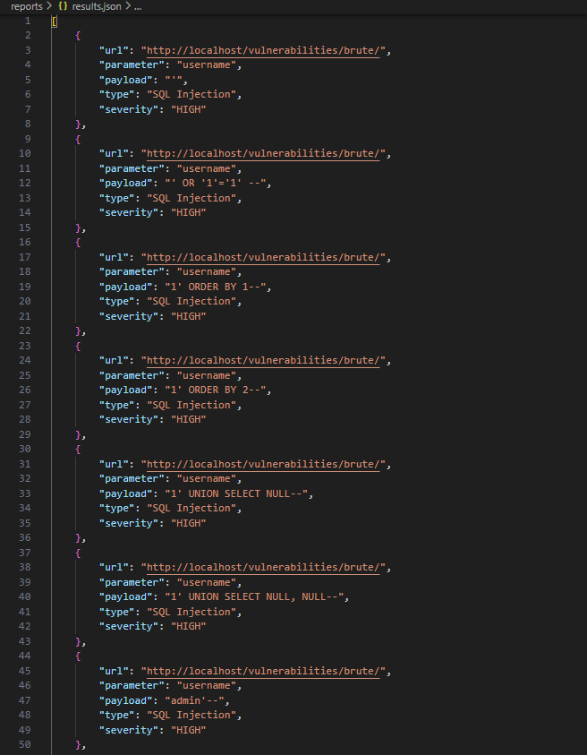

Here is the comprehensive documentation for **Week 3** and **Week 4** formatted as separate `README.md` files for your internship project.
# 📄 Week 3: SQL Injection (SQLi) Testing Module

## 1. What is SQL Injection?

**SQL Injection (SQLi)** is a security vulnerability where an attacker "injects" malicious SQL code into an input field (like a login box or search bar). If the application is not secure, the database executes this malicious code as part of its internal query.

**Why it is dangerous:**

* **Data Theft:** Attackers can steal sensitive data like passwords and credit card numbers.
* **Unauthorized Access:** Attackers can bypass login screens and act as administrators.
* **Data Loss:** Attackers can delete or modify entire database tables.

## 2. Payloads: What We Use and Why

Our tool uses a dedicated file, `sqli_payload.txt`, containing various test strings:

Payload,Technical Purpose
' and '',Basic tests to see if the application handles special characters without throwing a syntax error.
' OR '1'='1,"An authentication bypass payload. Since '1'='1' is always true, it forces the database to return records without a valid password."
' OR '1'='1' --,"Similar to above, but uses -- to comment out the rest of the original query, ensuring no syntax errors occur."
1' ORDER BY 1--,Used to determine the number of columns being returned by the database.
1' UNION SELECT NULL--,"Used to perform a ""Union-Based"" attack to join data from other tables into the current view."
1 AND 1=1,"A logical test. If the page loads normally for 1=1 but fails for 1=2, a vulnerability is confirmed."

## 3. How the Module Works (`sqli_scanner.py`)

1. **Targeting:** The scanner takes the input fields found by the crawler in Week 2.
2. **Injection:** It loops through every field and submits the SQL payloads.
3. **Error Signature Matching:** The scanner reads the server's response and looks for "Error Signatures" like *"MySQL Error"* or *"Syntax error"*.
4. **Data Storage:** If a vulnerability is found, the details (URL, parameter, and payload) are saved into a structured **JSON format** in `reports/results.json`.

