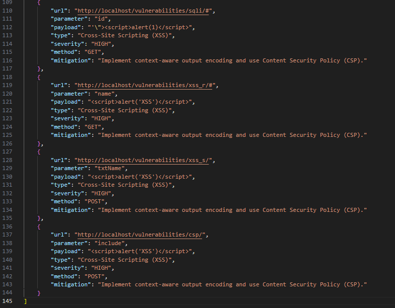

---

# 📄 Week 4: Cross-Site Scripting (XSS) Testing Module

## 1. What is Cross-Site Scripting?

**Cross-Site Scripting (XSS)** is a vulnerability where an attacker injects malicious JavaScript into a web page. Unlike SQLi, which targets the server's database, XSS targets the **users** of the website.

**Why it is dangerous:**

* **Session Hijacking:** Attackers can steal "Cookies" to take over a user's account.
* **Phishing:** Attackers can modify the page content to trick users into giving up credentials.
* **Malicious Redirects:** Users can be automatically sent to dangerous websites.

## 2. Payloads: What We Use and Why

Our tool uses `xss_payloads.txt` to test for "Reflected XSS":

Payload,Technical Purpose
,"The standard ""Proof of Concept"" to see if scripts are executed."
,Bypasses filters that block the ","Uses '""> to ""break out"" of an existing HTML attribute (like a value box) before running the script."
<scr`) is found inside the HTML, it confirms the site is vulnerable.
4. **Data Storage:** Like the SQLi module, confirmed hits are stored in `reports/results.json` with a **HIGH** severity rating.

---

# 📊 Results and JSON Persistence

A key achievement of Milestone 2 was moving from simple testing to **structured data storage**.

### Why store in JSON?

* **Organization:** It keeps a clean record of every vulnerability found during the scan.
* **Reporting:** In Week 7, we will use this JSON file to automatically generate a professional HTML Security Report.
* **Accuracy:** It records exactly which payload worked on which parameter, making it easy to fix the code later.

### Stored Result (`results.json`):

## ✅ Milestone 2 Outcome

By the end of Week 4, **WebScanPro** successfully evolved into an active security tool. It can now authenticate, crawl, inject, and verify vulnerabilities, saving all evidence into a persistent database for final reporting.