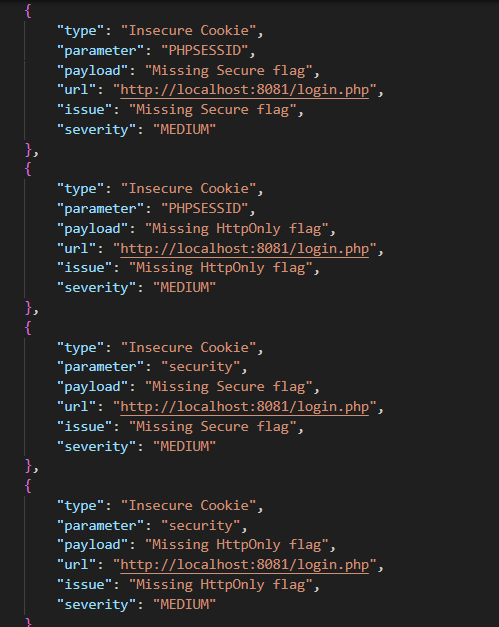

## 📄 Week 6: Access Control & IDOR Testing Module

### 1. What is IDOR & Path Traversal?
IDOR (Insecure Direct Object Reference) happens when a website uses a simple number in the URL like `?id=1` to fetch user data but does not check whether the logged-in user is actually allowed to see it. Path Traversal is when an attacker manipulates a file path input to make the server read sensitive system files it should not expose.

**Why it is dangerous:**
- **IDOR:** Any logged-in user can read another user's private data just by changing a number in the URL — no special permissions needed.
- **Path Traversal:** An attacker can access server files like `/etc/passwd` which contain system user information, leading to full server compromise.

### 2. How the Module Works (`idor_scanner.py`)

**IDOR Test (`test_idor`):**
1. Sends a baseline request with your own authorized ID to record a normal response
2. Loops through IDs 1 to 10 and sends a request for each
3. If the response is different from the baseline and returns real content — another user's data was accessed
4. Saves confirmed cases as **HIGH** severity findings

**Path Traversal Test (`test_path_traversal`):**
1. Injects 4 different traversal payloads into the parameter (`../../etc/passwd`, URL-encoded version, and filter-bypass versions)
2. After each request checks if `root:` appears in the response — this word is always at the start of a real `/etc/passwd` file
3. If found — the server followed the path and returned a system file — saves as **HIGH** severity

### 3. Stored Result (`results.json`)

✅ **Milestone 3 Outcome**
By the end of Week 6, WebScanPro can now test for weak credentials, insecure session handling, unauthorized data access, and server file exposure — saving all findings to `results.json` for the final report in Week 7.