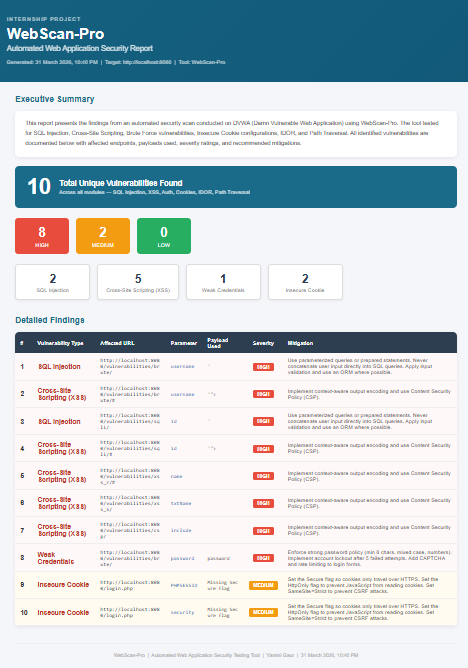

# 📌 Milestone 4 – Report Generation & Documentation

## 📖 Overview

Milestone 4 focuses on transforming raw vulnerability findings into a structured, professional security report and completing full project documentation.

This phase ensures that all detected vulnerabilities are clearly presented with severity levels, descriptions, and mitigation strategies — making the tool practical for real-world use.

---

## 🎯 Objectives

- Convert raw scan results (`results.json`) into a readable report  
- Organize vulnerabilities by type and severity  
- Provide mitigation strategies for each issue  
- Generate a professional HTML report automatically  
- Complete end-to-end project documentation  

---

## 🛠 Implementation

### 📄 Report Generator (`report_generator.py`)

The report generator converts scan results into a structured HTML report.



## 📊 Report Features

### 🧾 Executive Summary
- Overview of scan results  
- Total number of vulnerabilities detected  

### 🚨 Severity Breakdown
- HIGH, MEDIUM, LOW categorized visually  
- Helps prioritize fixes  

### 📈 Vulnerability Distribution
- Count of each vulnerability type:
  - SQL Injection  
  - XSS  
  - IDOR  
  - Authentication Issues  
  - Cookie Security Issues  

### 📋 Detailed Findings Table

Each vulnerability includes:
- Target URL  
- Affected parameter  
- Payload used  
- Severity level  
- Suggested mitigation  

---

## 🧪 How to Run

```bash
python report_generator.py