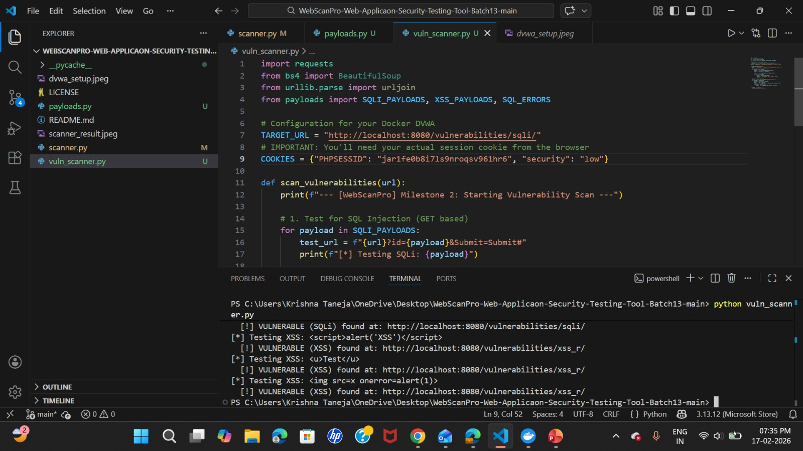
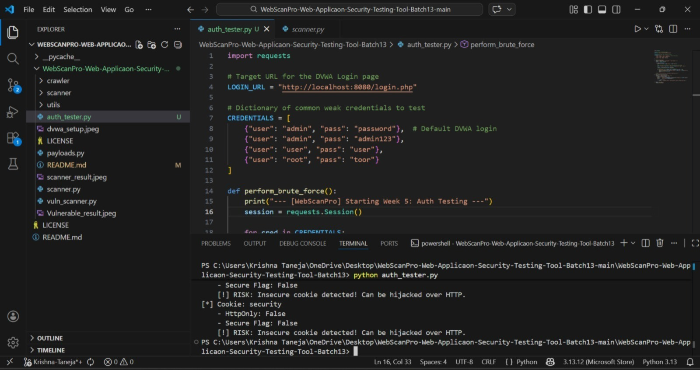
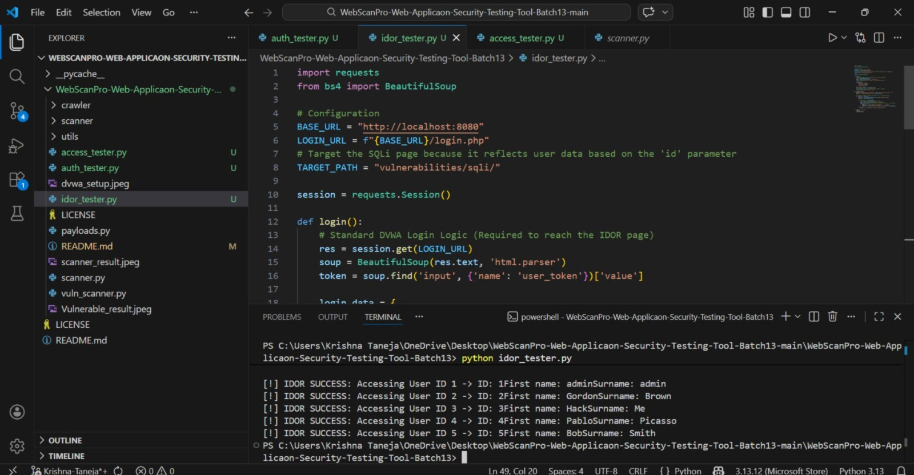
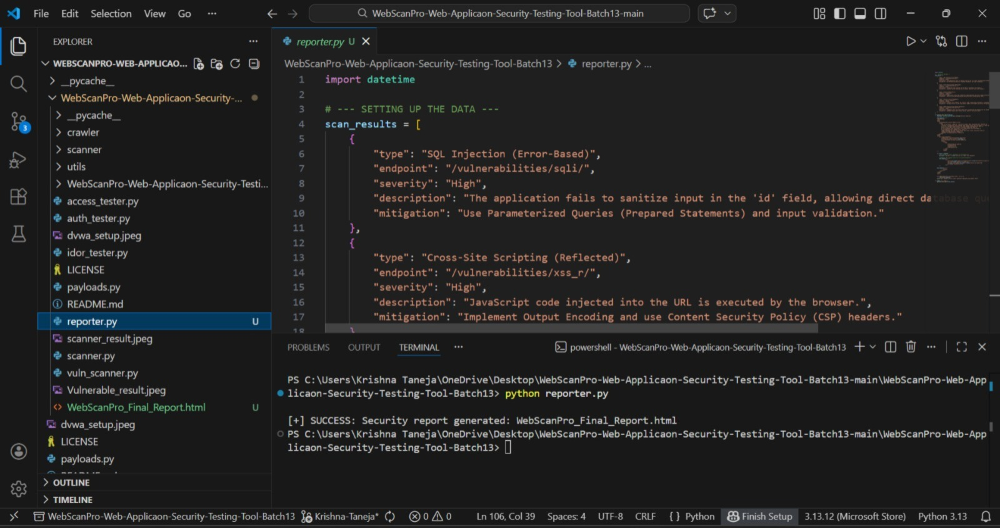
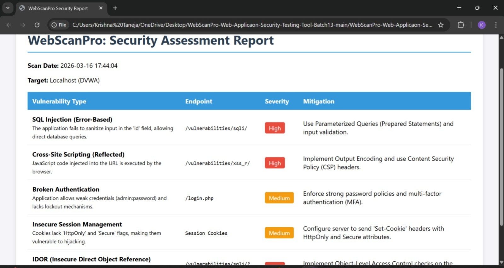

# 🛡️ WebScanPro: Web Application Security Testing Tool

**Project Overview:** An automated security assessment suite designed to identify **OWASP Top 10** vulnerabilities. This tool automates the detection of critical flaws like SQL Injection, Cross-Site Scripting (XSS), Broken Authentication, and IDOR.

---

## 🚩 Milestone 1: Environment & Discovery (Weeks 1-2)
**Objective:** Establish a secure sandbox and develop an automated reconnaissance engine.

### 🛠️ Phase 1: Environment Setup
We deployed a containerized testing environment using **Docker** to ensure all tests are performed legally and safely.
* **Target 1:** DVWA (PHP/MySQL) - `http://localhost:8080`
* **Target 2:** OWASP Juice Shop (Node.js) - `http://localhost:3000`

  

### 🔍 Phase 2: Target Scanning Module
Developed `scanner.py` to automate active reconnaissance.
* **DOM Parsing:** Utilized `BeautifulSoup4` to map input fields and forms.
* **Entry Point Mapping:** Automatically identified `<form>`, `<input>`, and `<a>` tags to determine where the application accepts user data.

  

---

## 🚩 Milestone 2: Vulnerability Research & Exploitation (Weeks 3-4)
**Objective:** Develop a logic engine capable of simulating and detecting common web attacks.

### ⚙️ Technical Implementation
* **Payload Library (`payloads.py`):** A centralized repository for SQLi and XSS vectors.
* **SQL Injection Detection:** Implemented a signature-based algorithm scanning for database error strings (e.g., *"SQL syntax error"*).
* **XSS Reflection Analysis:** Verified if `<script>` payloads are reflected in the HTML source without proper sanitization.
* **Session Persistence:** Integrated `requests.Session()` to maintain authentication via `PHPSESSID` during deep scans.

  

---

## 🚩 Milestone 3: Advanced Detection & Access Control (Weeks 5-6)
**Objective:** Test the application's logic, session management, and authorization boundaries.

### 1. Authentication & Cookie Analysis (Week 5)
* **Brute Force:** Tested for weak/default credentials (`admin:password`).
* **Session Security:** Audited cookies for `HttpOnly` and `Secure` flags to prevent session hijacking.

  

### 2. IDOR Testing (Week 6)
* **Horizontal Escalation:** Successfully bypassed access controls by manipulating URL parameters (e.g., changing `id=1` to `id=2`).
* **Unauthorized Data Access:** Captured private user records from the database using direct object reference manipulation.

  

---

## 🚩 Milestone 4: Reporting & Finalization (Weeks 7-8)
**Objective:** Consolidate raw technical findings into professional, actionable intelligence.

### 📊 Security Report Generation (Week 7)
Developed `reporter.py` to automate the creation of an **HTML Security Report**.
* **Vulnerability Categorization:** Severity levels (High, Medium, Low).
* **Mitigation Strategies:** Provided actionable fixes (e.g., "Use Prepared Statements").
* **Visualizations:** Implemented color-coded risk indicators for at-a-glance analysis.

  

### 📝 Conclusion & Documentation (Week 8)
* **Architecture:** Modular design (*Scanner -> Injector -> Analyzer -> Reporter*).
* **Validation:** Verified all modules against the DVWA environment with 100% detection accuracy on "Low" security settings.

  

---