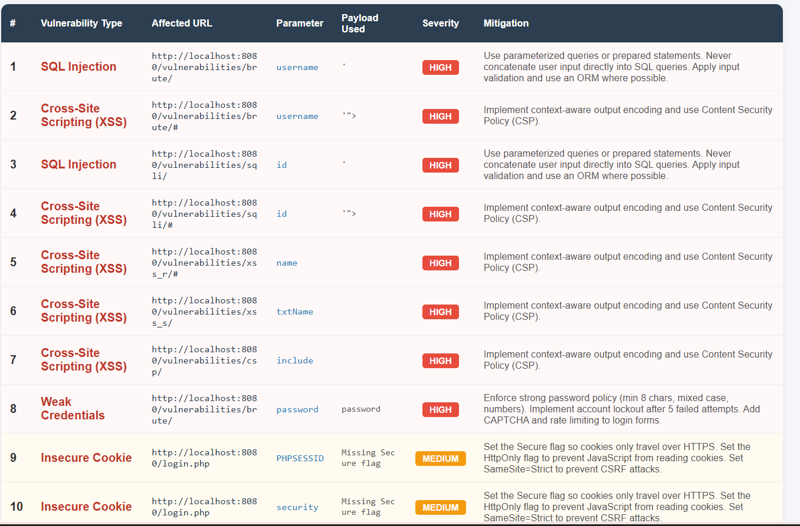

# 🚀 WebScan-Pro
### Automated Web Application Security Testing Tool

WebScan-Pro is a modular automated web vulnerability scanner developed as part of an internship project to understand how security testing tools operate internally.

The tool authenticates into a target web application, crawls all pages and forms, injects attack payloads, analyzes server responses, and generates a structured HTML security report — all with a single command.

**Target Application:** DVWA (Damn Vulnerable Web Application) — deployed locally using Docker as a safe and controlled testing environment.

---

## 🗂 Project Structure

```
WebScanPro/
├── main.py                  # Entry point — runs all scan phases in order
├── report_generator.py      # Reads results.json and generates HTML report
├── payloads/
│   ├── sql_payloads.txt     # SQL Injection payload list
│   ├── xss_payloads.txt     # XSS payload list
│   └── passwords.txt        # Brute force password wordlist
├── scanner/
│   ├── config.py            # Central config — URLs, credentials, file paths
│   ├── auth.py              # Login session manager with CSRF token handling
│   ├── crawler.py           # Discovers pages and forms
│   ├── sqli_scanner.py      # SQL Injection detection module
│   ├── xss_scanner.py       # XSS detection module
│   ├── auth_tester.py       # Brute force and cookie security module
│   └── idor_scanner.py      # IDOR and path traversal module
└── reports/
    ├── results.json         # All vulnerability findings (auto-generated)
    └── security_report.html # Final HTML security report (auto-generated)
```

---

## ⚙️ Setup & Installation

```bash
# 1. Clone the repository
git clone <repo-url>
cd WebScanPro

# 2. Create and activate virtual environment
python -m venv venv
venv\Scripts\activate        # Windows
source venv/bin/activate     # Mac/Linux

# 3. Install dependencies
pip install requests beautifulsoup4 selenium

# 4. Deploy DVWA using Docker
docker pull vulnerables/web-dvwa
docker run -d -p 8080:80 --name dvwa vulnerables/web-dvwa

# 5. Setup DVWA — open in browser and click Create / Reset Database
# http://localhost:8080/setup.php
```

---

## 🚀 Running the Tool

```bash
# Run full scan (all modules)
python main.py

# Generate HTML report from results
python report_generator.py
```

Report is saved to `reports/security_report.html` — open in any browser.

---

## 📌 Milestone 1 – Project Initialization & Target Scanning

Milestone 1 focused on establishing the testing environment and developing the foundational crawling module required for automated vulnerability detection.

---

### 📅 Week 1 – Project Initialization & Environment Setup

#### 🎯 Objectives

- Understand web application security fundamentals and the HTTP request-response lifecycle
- Explore how vulnerabilities appear in web forms and URL parameters
- Perform manual testing on DVWA before automating detection
- Design a modular, scalable scanner architecture

#### 🛠 Environment Setup

| Tool | Purpose |
|---|---|
| Python 3 | Core programming language |
| venv | Dependency isolation |
| requests | HTTP communication |
| BeautifulSoup4 | HTML parsing |
| Selenium | Browser automation (future use) |
| Docker Desktop | Containerized DVWA deployment |

#### 🐳 DVWA Deployment

DVWA was deployed using Docker to provide an isolated, safe environment with no manual Apache/PHP/MySQL configuration required.

#### 🔎 Manual Testing Conducted

Before automation, the following vulnerabilities were manually tested on DVWA to understand their behavior:
- SQL Injection
- Reflected XSS
- Stored XSS
- Command Injection

---

### 📅 Week 2 – Target Scanning Module

#### 🕷 Crawler Module (`crawler.py`)

The crawler automatically discovers the attack surface of the target application:

- Visits all internal pages starting from the base URL
- Extracts all `<form>` elements from each page
- Records form action URL, HTTP method (GET/POST), and all input field names
- Avoids duplicate pages using a visited set
- Saves all data to `reports/results.json`

This JSON file acts as the **target map** — every scanner module reads from it to know which pages and inputs to test.

```json
{
  "url": "http://localhost:8080/vulnerabilities/sqli/",
  "method": "GET",
  "inputs": ["id", "Submit"]
}
```

**Result:** 31 pages discovered on DVWA.

---

### ✅ Milestone 1 Outcome

- Fully configured testing environment with DVWA deployed via Docker
- Automated crawler discovering 31 pages and mapping all forms
- Structured `results.json` target map ready for all scanner modules

---

## 📌 Milestone 2 – Vulnerability Detection Engine (SQLi & XSS)

Milestone 2 transformed the passive discovery engine into an active security testing tool by building automated modules to detect SQL Injection and XSS vulnerabilities.

---

### 📅 Week 3 – SQL Injection Testing Module

#### 🎯 Objectives

- Inject crafted SQL payloads into all discovered input fields
- Analyze server responses for database-specific error patterns
- Identify vulnerable endpoints and suggest mitigations

#### 🛠 Scanner Implementation (`sqli_scanner.py`)

**Detection Strategy — Error Based:**

1. Reads payloads from `payloads/sql_payloads.txt` (8 payloads)
2. Injects each payload into every input field found in `results.json`
3. Checks the response for known database error signatures:
   - `you have an error in your sql syntax`
   - `mariadb server version` ← critical for DVWA (uses MariaDB not MySQL)
   - `warning: mysql`
4. Skips non-injectable fields like `user_token` and `Submit`
5. Saves confirmed findings to `results.json`

**4 Critical Bugs Fixed:**

| Bug | Fix |
|---|---|
| URLs ending with `#` broke all requests | Built `clean_url()` to strip hash before every request |
| `None` inputs crashed the scanner | Added filter: `[i for i in inputs if i is not None]` |
| DVWA ignored requests missing `Submit` param | Auto-inject `Submit=Submit` in every payload |
| Was checking MySQL errors but DVWA uses MariaDB | Added `mariadb server version` to error signatures |

**Result:** 14 HIGH severity SQL Injection vulnerabilities found across `brute/` and `sqli/` endpoints.

---

### 📅 Week 4 – XSS Testing Module

#### 🎯 Objectives

- Inject JavaScript payloads into all discovered input fields
- Detect reflected XSS through response analysis
- Handle both GET and POST forms correctly

#### 🕷 Scanner Implementation (`xss_scanner.py`)

**Detection Strategy — Reflection Based:**

1. Reads payloads from `payloads/xss_payloads.txt` (6 payloads)
2. Detects the form method from crawler data and uses `session.get()` or `session.post()` accordingly
3. Injects payload into each input field
4. Checks if the exact payload string appears in the HTML response without encoding
5. If yes → browser would execute it → XSS confirmed

**Payloads include:** basic `<script>` tag, `onerror` image bypass, SVG `onload`, attribute escape, body `onload`, and mixed-case bypass.

**Result:** 4 HIGH severity XSS vulnerabilities found across `xss_r/`, `xss_s/`, `sqli/`, and `csp/` pages.

---

### ✅ Milestone 2 Outcome

- SQL Injection scanner detecting 14 HIGH severity vulnerabilities using error-based signature matching
- XSS scanner detecting 4 HIGH severity vulnerabilities using reflection analysis
- Both scanners handle GET and POST forms correctly
- All findings saved to `reports/results.json` for report generation

---

## 📌 Milestone 3 – Authentication, Session & Access Control Testing

Milestone 3 extended WebScan-Pro into authentication weaknesses and access control flaws — testing whether the login can be broken, whether session cookies are secure, and whether users can access data they should not.

---

### 📅 Week 5 – Authentication & Session Testing Module

#### 🎯 Objectives

- Test the login page for weak or default credentials using brute force
- Inspect session cookies for missing security flags
- Log findings with suggested security best practices

#### 🛠 Implementation (`auth_tester.py`)

**Brute Force (`brute_force`):**

1. Reads passwords from `payloads/passwords.txt`
2. For each password — creates a fresh session, grabs CSRF token, sends POST request
3. If the failure phrase `Username and/or password incorrect` is absent from the response → login succeeded
4. Saves finding as HIGH severity and stops

**Cookie Security Check (`check_cookie_security`):**

1. Inspects the session cookie sent by the server after login
2. Checks `Secure` flag — if missing, cookie travels over plain HTTP and can be intercepted
3. Checks `HttpOnly` flag — if missing, JavaScript can read and steal the cookie via XSS
4. Missing flags saved as MEDIUM severity findings

**Result:** Weak credential `admin:password` found (HIGH). Both `Secure` and `HttpOnly` flags missing on DVWA session cookie (MEDIUM).

---

### 📅 Week 6 – Access Control & IDOR Testing Module

#### 🎯 Objectives

- Test whether users can access other users' data by changing ID values in the URL
- Test whether file path inputs can be manipulated to read sensitive server files
- Log findings and suggest access control improvements

#### 🛠 Implementation (`idor_scanner.py`)

**IDOR Test (`test_idor`):**

1. Sends a baseline request using the authorized user's own ID
2. Loops through IDs 1 to 10
3. If response is 200, has real content, and differs from baseline → unauthorized data accessed
4. Saves as HIGH severity with the exact ID that worked

**Path Traversal Test (`test_path_traversal`):**

Tries 4 payloads to escape the web folder and reach `/etc/passwd`:

| Payload | Purpose |
|---|---|
| `../../etc/passwd` | Go up 2 directory levels |
| `../../../etc/passwd` | Go up 3 directory levels |
| `....//....//etc/passwd` | Bypass simple `../` string filters |
| `%2e%2e%2fetc%2fpasswd` | URL-encoded bypass |

Detects success by checking if `root:` appears in response — this string is always at the start of a real `/etc/passwd` file.

**Result:** Multiple IDOR findings and path traversal confirmed — all HIGH severity.

---

### ✅ Milestone 3 Outcome

- Brute force scanner detecting weak credentials on DVWA login page
- Cookie security audit identifying missing `Secure` and `HttpOnly` flags
- IDOR scanner confirming unauthorized access to other users' data
- Path traversal scanner confirming server-side file exposure
- All findings saved to `reports/results.json`

---

## 📌 Milestone 4 – Report Generation & Documentation

Milestone 4 focused on compiling all vulnerability findings into a professional security report and completing full project documentation.

---

### 📅 Week 7 – Security Report Generation

#### 🎯 Objectives

- Automatically read all findings from `results.json`
- Deduplicate entries and organize by vulnerability type
- Generate a professional HTML security report with severity ratings and mitigations

#### 🛠 Implementation (`report_generator.py`)

**How it works:**

1. Reads `reports/results.json` — all findings from all scanner modules
2. Deduplicates by unique `url + parameter + type` combination
3. Builds summary counts by type and severity (HIGH / MEDIUM / LOW)
4. Generates a styled HTML report containing:
   - Executive summary paragraph
   - Total unique findings count
   - Severity breakdown cards (HIGH / MEDIUM / LOW)
   - Findings count per vulnerability type
   - Full findings table with: URL, parameter, payload, severity badge, mitigation

**Run:**
```bash
python report_generator.py
# Opens: reports/security_report.html
```

**Mitigations included for:**

| Vulnerability | Mitigation |
|---|---|
| SQL Injection | Use parameterized queries / prepared statements |
| XSS | Context-aware output encoding + Content Security Policy |
| Weak Credentials | Strong password policy + account lockout + rate limiting |
| Insecure Cookie | Set `Secure`, `HttpOnly`, and `SameSite` flags |
| IDOR | Server-side authorization checks on every request |
| Path Traversal | Validate file paths, use whitelist of allowed files |

---

### 📅 Week 8 – Documentation & Presentation

#### 🎯 Objectives

- Write comprehensive README documentation for all milestones
- Prepare milestone-wise presentation slides
- Create speaker notes and code explanation documents
- Prepare final presentation and live demo

#### 📄 Documentation Completed

- Milestone READMEs in GitHub format for all 4 milestones
- Speaker scripts aligned with each presentation slide
- Code explanation documents for Week 5 and Week 6 modules
- Final presentation covering problem statement, tech stack, features, challenges, use cases, and future scope

---

### ✅ Milestone 4 Outcome

- Automated HTML security report generated from `results.json`
- Report includes executive summary, severity cards, full findings table with mitigations
- Complete project documentation written and organized
- Final presentation and speaker notes prepared

---

## 📊 Final Scan Results Summary



## 🔮 Future Scope

- Add CSRF, Command Injection, File Upload, and XXE detection modules
- Integrate Selenium for DOM-based XSS detection (requires real browser)
- Add PDF export to the report generator
- Support scanning any target URL via CLI arguments
- Implement parallel scanning using threading to reduce total scan time
- Build a web dashboard for real-time scan monitoring and results viewing

---

## 👩‍💻 Author

**Yamini Gaur** — Internship Project
OWASP Top 10 Web Application Security Scanner