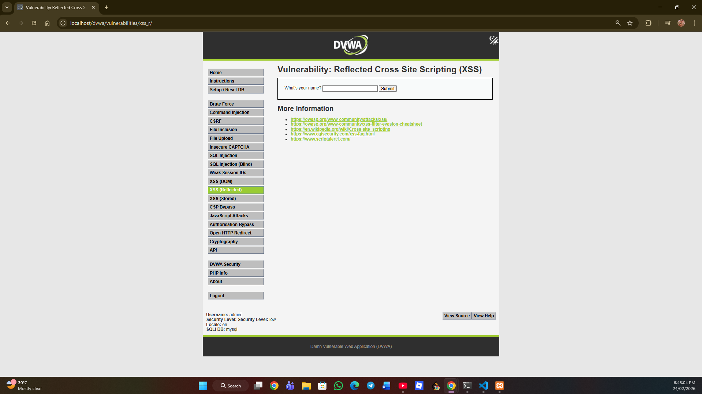
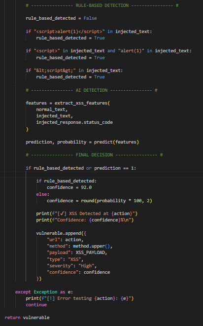

<div align="center">

# 🚀 WEBSCANPRO – WEB APPLICATION SECURITY TESTING TOOL - BATCH 13 🚀

</div>

---

# 📌 MILESTONE 1  
## Project Setup & Target Scanning Module  

This milestone covers the basic setup of the project and development of the first scanning module.

---

# 🔹 Week 1 – Project Initialization & Setup  

## 🔸 About the Project  

WebScanPro is a tool that checks web applications for common security problems like:

- SQL Injection  
- Cross-Site Scripting (XSS)  
- Weak login systems  
- Other common web security issues  

In Week 1, the goal was to set up everything and understand how the vulnerable application works.

---

## 🔸 Tools Used  

- XAMPP (Local Server – Apache & MySQL)  
- DVWA (Damn Vulnerable Web Application)  
- PHP & MySQL  
- Web Browser  
- Git & GitHub  

---

## 🔸 What I Did in Week 1  

### 1️⃣ Installed and Configured Environment  

- Installed XAMPP  
- Started Apache and MySQL  
- Downloaded DVWA  
- Placed DVWA inside `htdocs`  
- Created a database named `dvwa`  
- Updated configuration settings  
- Initialized the database  

After this, DVWA was running successfully in the browser.

---

## 🔸 Explored Vulnerability Modules  

I explored the following modules:

- **Brute Force Module** – Shows weak login system  
- **SQL Injection Module** – Shows database vulnerability  
- **XSS Module** – Shows how scripts can run in browser  

---

## 🔹 Manual SQL Injection Testing 

During exploration, I manually tested SQL Injection in the DVWA login form using the following payload:

```
' OR '1'='1
```

This test was done to check how the application handles unsafe user input.

### 💉 Manual SQL Injection Test Screenshot


---

---
## 🔸 Week 1 Result  

✔ DVWA installed successfully  
✔ Vulnerability pages identified  
✔ Input fields located  
✔ Environment ready for automation  

---

## 📸 Week 1 Screenshots  

### 🖥️ XAMPP Running  
  
*Fig 1.1: XAMPP Control Panel showing Apache and MySQL services running successfully.*

---

### 🏠 DVWA Dashboard  
  
*Fig 1.2: DVWA dashboard confirming successful installation and configuration.*

---

### 🔐 Brute Force Module  
  
*Fig 1.3: DVWA Brute Force vulnerability module interface.*

---

### 💉 SQL Injection Module  
  
*Fig 1.4: DVWA SQL Injection vulnerability testing page.*

---

### ⚡ XSS Reflected Module  
  
*Fig 1.5: DVWA Reflected XSS module page.*

---

# 🔹 Week 2 – Target Scanning Module  

## 🔸 Objective  

The goal of Week 2 was to build an enhanced Python-based scanning engine that automatically identifies:

- Forms  
- Input fields  
- Form actions  
- HTTP methods  
- Internal URLs (Basic Crawling)  
- Hidden form tokens  

This structured data will be used for automated vulnerability testing in upcoming modules.

---

## 🔸 Technologies Used  

- Python 3.x  
- Requests (Session Handling Enabled)  
- BeautifulSoup  
- JSON  
- DVWA  
- XAMPP  

---

## 🔸 About scanner.py  

`scanner.py` is a modular scanning script designed to analyze the structure of a web application.

### 🔹 Key Capabilities:

- Initiates session using `requests.Session()`  
- Crawls internal links within the target scope  
- Extracts all `<form>` elements  
- Identifies:
  - Form action  
  - HTTP method (GET/POST)  
  - Input field names  
  - Input types  
  - Hidden fields (CSRF tokens, etc.)  
- Prevents duplicate URL scanning  
- Generates structured output files  
- Includes basic error handling for stability  

The scanner performs **passive reconnaissance only**.  
It does not inject payloads or exploit vulnerabilities.

---

## 🔸 How the Scanner Works  

1. Starts from:  
```
http://localhost/dvwa/
```
2. Creates a persistent HTTP session  
3. Discovers internal links  
4. Parses HTML using BeautifulSoup  
5. Extracts forms and input fields  
6. Stores structured results into output files  

---

## 🔸 Output Files  

### 📄 output.json  

Contains structured scanning results including:

- Discovered URLs  
- Page-level form mapping  
- Input field details  
- Hidden parameters  

### 📄 Output JSON Result  

```
{
    {
    "urls": [],
    "forms": []
}
```

---

### 📄 output.txt  

Readable scan summary for quick analysis.

### 📄 Output TXT Result  
```
=== Discovered URLs ===

=== Forms & Input Fields ===

```

---

## 🔸 Scan Results  

The scanner successfully:

✔ Discovered internal URLs  
✔ Extracted login form  
✔ Captured hidden security tokens  
✔ Identified HTTP methods  
✔ Organized data into structured JSON  

This prepares the foundation for automated SQL Injection and XSS testing.

---

## 📸 Week 2 Screenshots  

### ▶ Scanner Execution Output  
  
*Fig 2.1: Execution of scanner.py showing discovered URLs and forms.*

---

### 🐍 Python Version Verification  
  
*Fig 2.2: Python version verification for development environment.*

---

## 🔸 Limitations  

- Authentication automation not implemented  
- Depth-based crawling not configurable yet  
- No payload injection engine integrated  
- No vulnerability scoring module  

---

# ✅ Milestone 1 Summary  

✔ Local testing environment configured  
✔ Vulnerability modules analyzed  
✔ Python-based scanning engine developed  
✔ Internal link discovery implemented  
✔ Session-based crawling enabled  
✔ Structured JSON reporting system created  
✔ Automation-ready architecture prepared  

Milestone 1 establishes a strong foundation for developing a complete web application security testing framework.

---

# 📌 MILESTONE 2  
## Active Vulnerability Testing & AI Integration  

Milestone 2 upgrades WebScanPro from passive scanning to active vulnerability detection with hybrid AI integration.

---

# 🔹 Week 3 – SQL Injection Testing Module  

## 🔸 Objective  

To implement an automated **Active SQL Injection Detection Engine**.

---

## 🔸 Technologies Used  

- Python  
- Requests  
- BeautifulSoup  
- JSON  
- DVWA (Security Level: LOW)  

---

## 🔸 About `sqli_tester.py`  

The module:

- Logs into DVWA  
- Sets security level to LOW  
- Extracts CSRF tokens  
- Injects SQL payload  
- Detects vulnerabilities  
- Generates JSON report  

---

## 🔸 SQL Payload Used  
```
' OR 1=1 --
```

---

## 🔸 Detection Techniques  

### 1️⃣ Error-Based Detection  

Searches for SQL-related error messages such as:

- SQL syntax errors  
- mysqli exceptions  
- Fatal errors  

If detected → SQL Injection vulnerability confirmed.

---

### 2️⃣ Response Comparison  

Compares normal vs injected response to detect abnormal behavior or unexpected output differences.

---

## 📄 Output – `sqli_results.json`  

```json
{
  "vulnerabilities": [
    {
      "url": "http://localhost/dvwa/vulnerabilities/sqli/",
      "method": "GET",
      "payload": "' OR 1=1 --",
      "type": "SQL Injection",
      "severity": "High"
    }
  ]
}
```
## 📸 Week 3 Screenshots  

### 🔐 SQL Login Automation  
  
*Fig 3.1: Automated login process into DVWA using session handling.*

---

### 🛑 SQL Injection Detection Output  
  
*Fig 3.2: SQL Injection vulnerability detected by automated testing module.*

---

### 🌐 Manual SQL Error Proof  
  
*Fig 3.3: Manual SQL Injection test confirming database vulnerability.*

---

### 📄 SQL JSON Result  
  
*Fig 3.4: Generated JSON report containing detected SQL Injection vulnerability.*

---

### 🚀 Full Scan Execution  
  
*Fig 3.5: Complete execution of scanner and SQL Injection module via main.py.*

---

## 🔸 Week 3 Result  

✔ Active SQL Injection testing implemented  
✔ Authenticated testing enabled  
✔ CSRF token handling automated  
✔ Structured vulnerability reporting generated  

---

# 🔹 Week 4 – Hybrid XSS Testing Module (AI-Enhanced)

## 🔸 Objective  

To develop a **Hybrid XSS Detection Engine** using:

✔ Rule-Based Detection  
✔ Machine Learning Classification  
✔ Confidence Scoring  

---

## 🔸 Technologies Used  

- Python  
- Requests  
- BeautifulSoup  
- Scikit-learn (Logistic Regression)  
- Pickle  
- JSON  

---

## 🔸 About `xss_tester.py`  

The module:

- Authenticates into DVWA  
- Sets security level LOW  
- Injects XSS payload  
- Applies rule-based detection  
- Extracts ML features  
- Runs AI prediction  
- Calculates confidence score  
- Generates JSON report  

---

## 🔸 XSS Payload Used  

```
<script>alert(1)</script>
```

---

## 🔸 Hybrid Detection Architecture  

### 🔹 Rule-Based Detection  

Checks:

- Direct payload reflection  
- Script tag presence  
- Encoded script tags  

---

### 🔹 AI-Based Detection  

`prediction, probability = predict(features)`

---

### 🔹 Final Decision Logic  

`if rule_based_detected or prediction == 1:`

This hybrid approach improves detection reliability and reduces false negatives.

---

## 📄 Output – xss_results.json  
```
{
    "vulnerabilities": [
        {
            "url": "http://localhost/dvwa/vulnerabilities/xss_r/",
            "method": "GET",
            "payload": "<script>alert(1)</script>",
            "type": "XSS",
            "severity": "High",
            "confidence": 92.0
        }
    ]
}
```

---

## 📸 Week 4 Screenshots  

### 🌐 DVWA XSS Page  
  
*Fig 4.1: DVWA Reflected XSS testing interface.*

---

### 💉 Manual XSS Payload Execution  
  
*Fig 4.2: Manual execution of XSS payload in DVWA application.*

---

### 🤖 AI XSS Detection in Terminal  
  
*Fig 4.3: Hybrid AI-based XSS detection output in terminal.*

---

### 📄 XSS JSON Result  
  
*Fig 4.4: Structured JSON report generated after XSS detection.*

---

### 🧠 Hybrid Detection Logic  
  
*Fig 4.5: Hybrid detection engine combining rule-based and AI-based analysis.*

---

## 🔸 Week 4 Result  

✔ Reflected XSS detected successfully  
✔ Hybrid AI detection engine implemented  
✔ Confidence scoring integrated  
✔ AI-augmented vulnerability scanning established  

