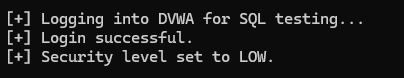

<div align="center">

# 🚀 WEBSANPRO – WEB APPLICATION SECURITY TESTING TOOL - BATCH 13 🚀

</div>

---

# 📌 MILESTONE 1  
## Project Setup & Target Scanning Module  

This milestone covers the basic setup of the project and development of the first scanning module.

---

# 🔹 Week 1 – Project Initialization & Setup  

## 🔸 About the Project  

WebScanPro is a tool that checks web applications for common security problems like:

- SQL Injection  
- Cross-Site Scripting (XSS)  
- Weak login systems  
- Other common web security issues  

In Week 1, the goal was to set up everything and understand how the vulnerable application works.

---

## 🔸 Tools Used  

- XAMPP (Local Server – Apache & MySQL)  
- DVWA (Damn Vulnerable Web Application)  
- PHP & MySQL  
- Web Browser  
- Git & GitHub  

---

## 🔸 What I Did in Week 1  

### 1️⃣ Installed and Configured Environment  

- Installed XAMPP  
- Started Apache and MySQL  
- Downloaded DVWA  
- Placed DVWA inside `htdocs`  
- Created a database named `dvwa`  
- Updated configuration settings  
- Initialized the database  

After this, DVWA was running successfully in the browser.

---

## 🔸 Explored Vulnerability Modules  

I explored the following modules:

- **Brute Force Module** – Shows weak login system  
- **SQL Injection Module** – Shows database vulnerability  
- **XSS Module** – Shows how scripts can run in browser  

---

## 🔹 Manual SQL Injection Testing 

During exploration, I manually tested SQL Injection in the DVWA login form using the following payload:

```
' OR '1'='1
```

This test was done to check how the application handles unsafe user input.

### 💉 Manual SQL Injection Test Screenshot


---

---
## 🔸 Week 1 Result  

✔ DVWA installed successfully  
✔ Vulnerability pages identified  
✔ Input fields located  
✔ Environment ready for automation  

---

## 📸 Week 1 Screenshots  

### 🖥️ XAMPP Running


### 🏠 DVWA Dashboard


### 🔐 Brute Force Module


### 💉 SQL Injection Module


### ⚡ XSS Reflected Module

  

---

# 🔹 Week 2 – Target Scanning Module  

## 🔸 Objective  

The goal of Week 2 was to build an enhanced Python-based scanning engine that automatically identifies:

- Forms  
- Input fields  
- Form actions  
- HTTP methods  
- Internal URLs (Basic Crawling)  
- Hidden form tokens  

This structured data will be used for automated vulnerability testing in upcoming modules.

---

## 🔸 Technologies Used  

- Python 3.x  
- Requests (Session Handling Enabled)  
- BeautifulSoup  
- JSON  
- DVWA  
- XAMPP  

---

## 🔸 About scanner.py  

`scanner.py` is a modular scanning script designed to analyze the structure of a web application.

### 🔹 Key Capabilities:

- Initiates session using `requests.Session()`  
- Crawls internal links within the target scope  
- Extracts all `<form>` elements  
- Identifies:
  - Form action  
  - HTTP method (GET/POST)  
  - Input field names  
  - Input types  
  - Hidden fields (CSRF tokens, etc.)  
- Prevents duplicate URL scanning  
- Generates structured output files  
- Includes basic error handling for stability  

The scanner performs **passive reconnaissance only**.  
It does not inject payloads or exploit vulnerabilities.

---

## 🔸 How the Scanner Works  

1. Starts from:  
```
http://localhost/dvwa/
```
2. Creates a persistent HTTP session  
3. Discovers internal links  
4. Parses HTML using BeautifulSoup  
5. Extracts forms and input fields  
6. Stores structured results into output files  

---

## 🔸 Output Files  

### 📄 output.json  

Contains structured scanning results including:

- Discovered URLs  
- Page-level form mapping  
- Input field details  
- Hidden parameters  

### 📄 Output JSON Result  

```
{
    {
    "urls": [],
    "forms": []
}
```

---

### 📄 output.txt  

Readable scan summary for quick analysis.

### 📄 Output TXT Result  
```
=== Discovered URLs ===

=== Forms & Input Fields ===

```

---

## 🔸 Scan Results  

The scanner successfully:

✔ Discovered internal URLs  
✔ Extracted login form  
✔ Captured hidden security tokens  
✔ Identified HTTP methods  
✔ Organized data into structured JSON  

This prepares the foundation for automated SQL Injection and XSS testing.

---

## 📸 Week 2 Screenshots  

### ▶ Scanner Execution Output  


### 🐍 Python Version Verification  


---

## 🔸 Limitations  

- Authentication automation not implemented  
- Depth-based crawling not configurable yet  
- No payload injection engine integrated  
- No vulnerability scoring module  

---

# ✅ Milestone 1 Summary  

✔ Local testing environment configured  
✔ Vulnerability modules analyzed  
✔ Python-based scanning engine developed  
✔ Internal link discovery implemented  
✔ Session-based crawling enabled  
✔ Structured JSON reporting system created  
✔ Automation-ready architecture prepared  

Milestone 1 establishes a strong foundation for developing a complete web application security testing framework.

---

# 🔹 Week 3 – SQL Injection Testing Module  

## 🔸 Objective  

The objective of Week 3 was to develop an **Active Vulnerability Testing Module** capable of automatically detecting SQL Injection vulnerabilities in a web application.

Unlike Week 2 (Passive Reconnaissance), Week 3 focuses on:

✔ Active payload injection  
✔ Authenticated testing  
✔ CSRF token handling  
✔ Automated vulnerability detection  
✔ Structured reporting  

---

## 🔸 Technologies Used  

- Python 3.x  
- Requests (Session Handling)  
- BeautifulSoup (Token Extraction)  
- JSON  
- DVWA (Security Level: LOW)  
- XAMPP  

---

## 🔸 About `sqli_tester.py`

`sqli_tester.py` is the active testing engine of WebScanPro.

It automatically:

- Logs into DVWA  
- Forces security level to LOW  
- Maintains authenticated session  
- Extracts fresh CSRF tokens dynamically  
- Injects SQL payload  
- Detects SQL Injection vulnerabilities  
- Generates structured vulnerability report  

---

## 🔸 SQL Injection Payload Used  

```
' OR 1=1 --
```

This payload is used to test how the application handles unsafe database queries.

---

## 🔸 How the SQL Module Works  

### Step-by-Step Execution Flow:

1️⃣ Loads `output.json` generated by scanner  
2️⃣ Logs into DVWA using session authentication  
3️⃣ Sets security level to LOW  
4️⃣ Extracts CSRF token from SQL Injection page  
5️⃣ Sends two requests:
   - Normal request → `id=1`
   - Injected request → `' OR 1=1 --`
6️⃣ Compares responses  
7️⃣ Detects SQL error messages  
8️⃣ Logs vulnerability into `sqli_results.json`

---

## 🔸 Detection Techniques Implemented  

### 1️⃣ Error-Based Detection  

The module searches for SQL error messages such as:

- `You have an error in your SQL syntax`
- `mysqli_sql_exception`
- `Fatal error`
- `Warning: mysqli`

If detected → SQL Injection vulnerability confirmed.

---

### 2️⃣ Response Comparison (Backup Check)

The module compares:

- Normal response  
- Injected response  

If significant difference is found → Potential SQL Injection.

---

## 🔸 Output File  

### 📄 `sqli_results.json`

Example Output:

```json
{
    "vulnerabilities": [
        {
            "url": "http://localhost/dvwa/vulnerabilities/sqli/",
            "method": "GET",
            "payload": "' OR 1=1 --",
            "type": "SQL Injection",
            "severity": "High"
        }
    ]
}
```
---

## 🔸 Execution Using main.py  

The complete automated workflow is executed using:

```bash
py main.py
```
---

## 🔹 Execution Order:

1️⃣ `scanner.py` → Discovers URLs & Forms  
2️⃣ `sqli_tester.py` → Performs Active SQL Injection Testing  

This modular architecture ensures clear separation between:

- Passive Reconnaissance  
- Active Vulnerability Exploitation  

---

# 📸 Week 3 Screenshots  




---

## 🔸 Week 3 Results  

✔ Authenticated SQL testing implemented  
✔ Security level automation integrated  
✔ CSRF token extraction handled  
✔ Error-based SQL Injection detection working  
✔ Automated vulnerability reporting generated  
✔ Modular active scanning architecture established  

---

