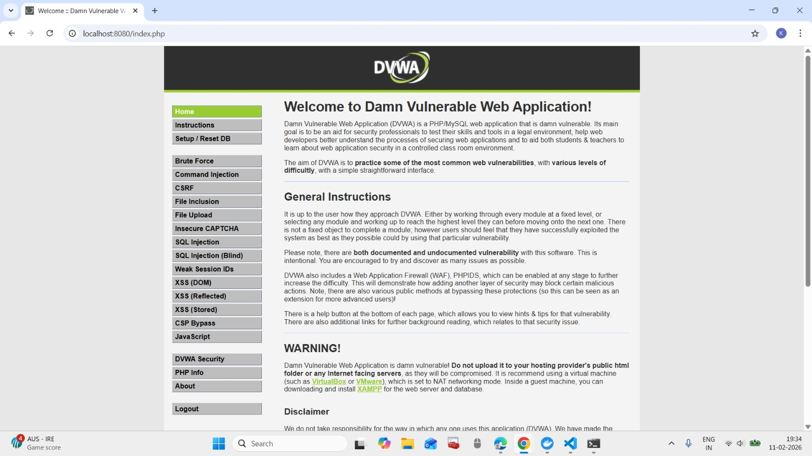
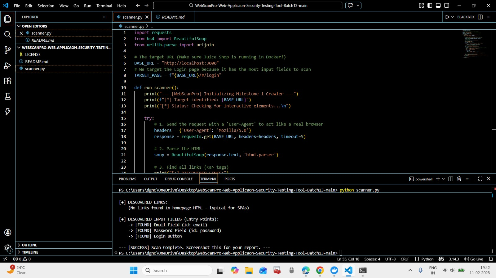

# WebScanPro-Web-Applicaon-Security-Testing-Tool-Batch13
## Milestone 1 Progress Report

**Status:** Completed ✅

---

## 📋 Overview
I have successfully completed the foundation of **WebScanPro**. This milestone focused on establishing a secure testing environment and developing the initial automated discovery module.

## 🛠️ Phase 1: Environment Setup (Week 1)
I have deployed intentionally vulnerable applications to serve as targets for our scanner. These are hosted locally to ensure a safe and legal testing environment.

| Target Application | Deployment Method | URL |
| :--- | :--- | :--- |
| **DVWA** | Docker / PHP Stack | `http://localhost:8080` |
| **OWASP Juice Shop** | Docker / Node.js SPA | `http://localhost:3000` |

#### **Week 1 Evidence:**

*Figure 1: The DVWA login and home interface running locally.*

> **Student Note:** I verified that DVWA is running correctly. I noticed its structure is highly dependent on session cookies, which I will need to handle in the next phase.

---

## 🔍 Phase 2: Target Scanning Module (Week 2)
I developed `scanner.py`, a Python-based discovery engine that identifies "Entry Points" for potential attacks.

### Technical Implementation:
* **Library:** Used `BeautifulSoup` for HTML parsing and `Requests` for HTTP communication.
* **Logic:** The script mimics a real browser using a `User-Agent` header to fetch the page and extract interactive elements.
* **Findings:**
    * Successfully identified **Email** and **Password** fields on the login page.
    * Detected the **Login Button** as the submission trigger.
    * Confirmed that **Juice Shop** is an SPA (Single Page Application), which will require dynamic scanning later.
#### **Week 2 Evidence:**

*Figure 2: Terminal output showing the scanner successfully identifying email and password fields.*
### Sample Output:
``text
[+] DISCOVERED INPUT FIELDS:
 -> [FOUND] Email Field (id: email)
 -> [FOUND] Password Field (id: password)
 -> [FOUND] Login Button

## 🚀 Milestone 2: Vulnerability Detection Engine (Weeks 3-4)

In this milestone, the tool was upgraded from a simple crawler to a functional **Vulnerability Scanner**. The core focus was on implementing detection logic for the two most common web attacks: **SQL Injection (SQLi)** and **Cross-Site Scripting (XSS)**.

### 📸 Execution Screenshot

*Figure: WebScanPro detecting SQLi and XSS vulnerabilities on a local Docker environment.*

---

### 🔍 Technical Explanation

1. **Modular Architecture**: 
   - Created `payloads.py` to store a dictionary of attack vectors, making the tool easily expandable.
   - Developed `vuln_scanner.py` to handle the core logic of sending requests and analyzing responses.

2. **Detection Logic**:
   - **SQL Injection**: The scanner injects classic payloads (e.g., `' OR 1=1 --`) and monitors the HTTP response for database error signatures like `"you have an error in your sql syntax"`.
   - **XSS (Reflected)**: The scanner injects `<script>` tags and checks if the exact payload is "reflected" in the website's HTML source code without proper sanitization.

3. **Session Management**:
   - Integrated **Cookie Persistence** using the `PHPSESSID`. This allows the script to remain authenticated within the DVWA (Docker) environment while performing attacks on protected internal pages.

4. **Security Context**:
   - Tests were successfully validated on the **Low Security** setting of DVWA, confirming that the detection engine accurately identifies uncleaned inputs.
