<div align="center">

# 🚀 WEBSCANPRO – WEB APPLICATION SECURITY TESTING TOOL - BATCH 13 🚀

</div>

---

# 📌 MILESTONE 1  
## Project Setup & Target Scanning Module  

This milestone covers the basic setup of the project and development of the first scanning module.

---

# 🔹 Week 1 – Project Initialization & Setup  

## 🔸 About the Project  

WebScanPro is a tool that checks web applications for common security problems like:

- SQL Injection  
- Cross-Site Scripting (XSS)  
- Weak login systems  
- Other common web security issues  

In Week 1, the goal was to set up everything and understand how the vulnerable application works.

---

## 🔸 Tools Used  

- XAMPP (Local Server – Apache & MySQL)  
- DVWA (Damn Vulnerable Web Application)  
- PHP & MySQL  
- Web Browser  
- Git & GitHub  

---

## 🔸 What I Did in Week 1  

### 1️⃣ Installed and Configured Environment  

- Installed XAMPP  
- Started Apache and MySQL  
- Downloaded DVWA  
- Placed DVWA inside `htdocs`  
- Created a database named `dvwa`  
- Updated configuration settings  
- Initialized the database  

After this, DVWA was running successfully in the browser.

---

## 🔸 Explored Vulnerability Modules  

I explored the following modules:

- **Brute Force Module** – Shows weak login system  
- **SQL Injection Module** – Shows database vulnerability  
- **XSS Module** – Shows how scripts can run in browser  

---

## 🔹 Manual SQL Injection Testing 

During exploration, I manually tested SQL Injection in the DVWA login form using the following payload:

```bash
' OR '1'='1
```

This test was done to check how the application handles unsafe user input.

### 💉 Manual SQL Injection Test Screenshot
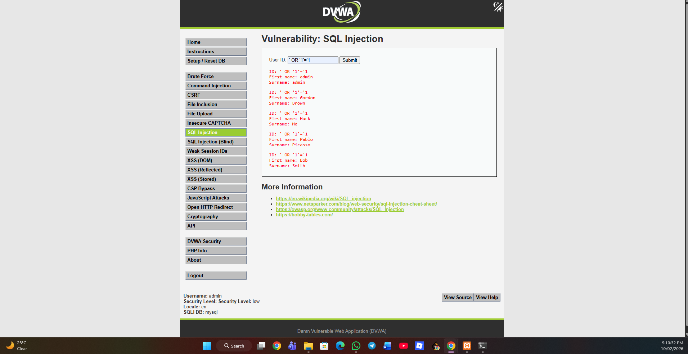

---

---
## 🔸 Week 1 Result  

✔ DVWA installed successfully  
✔ Vulnerability pages identified  
✔ Input fields located  
✔ Environment ready for automation  

---

## 📸 Week 1 Screenshots  

### 🖥️ XAMPP Running  
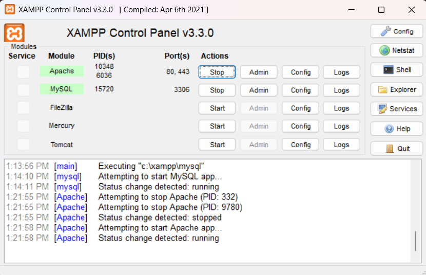  
*Fig 1.1: XAMPP Control Panel showing Apache and MySQL services running successfully.*

---

### 🏠 DVWA Dashboard  
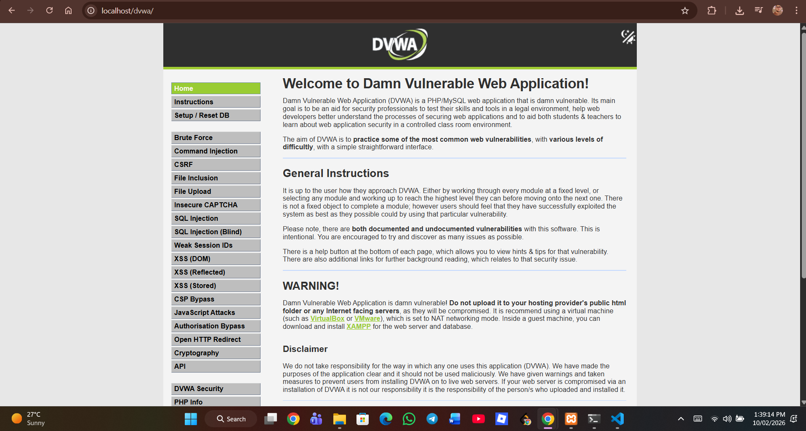  
*Fig 1.2: DVWA dashboard confirming successful installation and configuration.*

---

### 🔐 Brute Force Module  
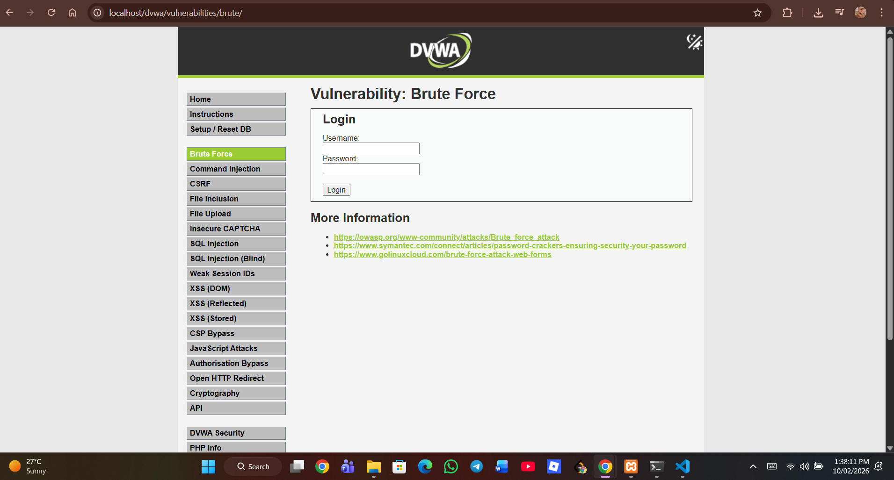  
*Fig 1.3: DVWA Brute Force vulnerability module interface.*

---

### 💉 SQL Injection Module  
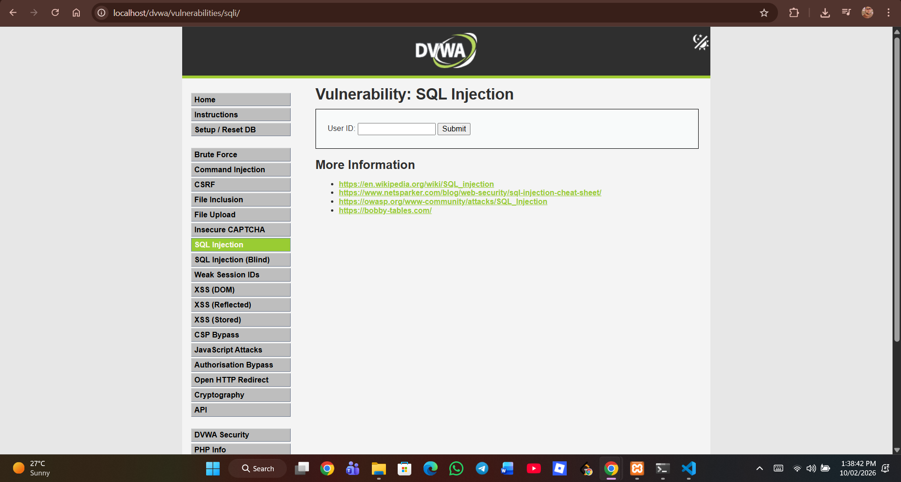  
*Fig 1.4: DVWA SQL Injection vulnerability testing page.*

---

### ⚡ XSS Reflected Module  
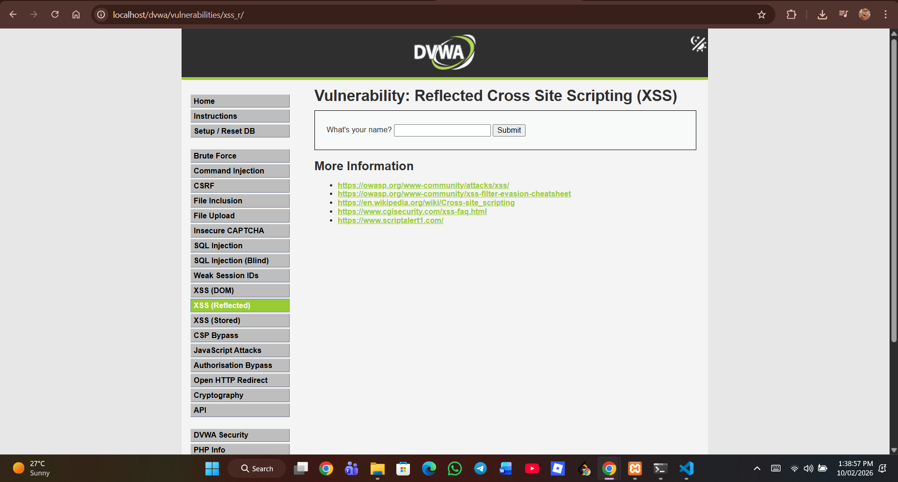  
*Fig 1.5: DVWA Reflected XSS module page.*

---

# 🔹 Week 2 – Target Scanning Module  

## 🔸 Objective  

The goal of Week 2 was to build an enhanced Python-based scanning engine that automatically identifies:

- Forms  
- Input fields  
- Form actions  
- HTTP methods  
- Internal URLs (Basic Crawling)  
- Hidden form tokens  

This structured data will be used for automated vulnerability testing in upcoming modules.

---

## 🔸 Technologies Used  

- Python 3.x  
- Requests (Session Handling Enabled)  
- BeautifulSoup  
- JSON  
- DVWA  
- XAMPP  

---

## 🔸 About scanner.py  

`scanner.py` is a modular scanning script designed to analyze the structure of a web application.

### 🔹 Key Capabilities:

- Initiates session using `requests.Session()`  
- Crawls internal links within the target scope  
- Extracts all `<form>` elements  
- Identifies:
  - Form action  
  - HTTP method (GET/POST)  
  - Input field names  
  - Input types  
  - Hidden fields (CSRF tokens, etc.)  
- Prevents duplicate URL scanning  
- Generates structured output files  
- Includes basic error handling for stability  

The scanner performs **passive reconnaissance only**.  
It does not inject payloads or exploit vulnerabilities.

---

## 🔸 How the Scanner Works  

1. Starts from:  
```
http://localhost/dvwa/
```
2. Creates a persistent HTTP session  
3. Discovers internal links  
4. Parses HTML using BeautifulSoup  
5. Extracts forms and input fields  
6. Stores structured results into output files  

---

## 🔸 Output Files  

### 📄 output.json  

Contains structured scanning results including:

- Discovered URLs  
- Page-level form mapping  
- Input field details  
- Hidden parameters  

### 📄 Output JSON Result  

```python
{
    {
    "urls": [],
    "forms": []
}
```

---

### 📄 output.txt  

Readable scan summary for quick analysis.

### 📄 Output TXT Result 

```python

=== Discovered URLs ===

=== Forms & Input Fields ===

```

---

## 🔸 Scan Results  

The scanner successfully:

✔ Discovered internal URLs  
✔ Extracted login form  
✔ Captured hidden security tokens  
✔ Identified HTTP methods  
✔ Organized data into structured JSON  

This prepares the foundation for automated SQL Injection and XSS testing.

---

## 📸 Week 2 Screenshots  

### ▶ Scanner Execution Output  
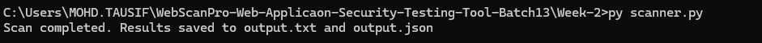  
*Fig 2.1: Execution of scanner.py showing discovered URLs and forms.*

---

### 🐍 Python Version Verification  
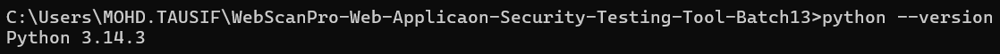  
*Fig 2.2: Python version verification for development environment.*

---

## 🔸 Limitations  

- Authentication automation not implemented  
- Depth-based crawling not configurable yet  
- No payload injection engine integrated  
- No vulnerability scoring module  

---

# ✅ Milestone 1 Summary  

✔ Local testing environment configured  
✔ Vulnerability modules analyzed  
✔ Python-based scanning engine developed  
✔ Internal link discovery implemented  
✔ Session-based crawling enabled  
✔ Structured JSON reporting system created  
✔ Automation-ready architecture prepared  

Milestone 1 establishes a strong foundation for developing a complete web application security testing framework.

---
# 📌 MILESTONE 2  
## Active Vulnerability Testing & Hybrid AI Integration  

Milestone 2 upgrades WebScanPro from passive scanning to an **AI-powered active vulnerability detection framework**.

This milestone introduces automated vulnerability testing modules capable of detecting **input-based security flaws** commonly found in web applications.

Key capabilities introduced in this milestone include:

✔ Hybrid SQL Injection Detection (Rule-Based + AI)  
✔ Hybrid XSS Detection (Rule-Based + AI)  
✔ Multi-payload vulnerability testing  
✔ HTTP response behavior monitoring  
✔ AI-assisted vulnerability classification  
✔ Confidence-based vulnerability scoring  
✔ Structured JSON vulnerability reporting  

These modules transform WebScanPro into an **active web security testing tool capable of automatically identifying exploitable vulnerabilities**.

---

# 🔹 Week 3 – Hybrid SQL Injection Testing Module (AI-Enhanced)

## 🔸 Objective  

The objective of Week 3 was to design and implement a **Hybrid SQL Injection Detection Engine** capable of automatically identifying SQL Injection vulnerabilities.

The module combines **traditional rule-based detection with AI-based behavioral analysis** to improve detection accuracy.

---

## 🔸 Technologies Used  

- Python  
- Requests  
- BeautifulSoup  
- Scikit-learn (Logistic Regression)  
- JSON  
- Pickle  
- DVWA (Security Level: LOW)  

---

## 🔸 About `sqli_tester.py`

The SQL Injection testing module performs the following tasks:

- Automated DVWA authentication  
- Security level configuration  
- Dynamic CSRF token extraction  
- SQL payload injection  
- HTTP response code monitoring  
- Response time comparison  
- Response length difference analysis  
- Rule-based SQL error detection  
- AI-based behavioral classification  
- Confidence score generation  
- JSON vulnerability reporting  

---

## 🔸 SQL Payloads Used  

To improve detection reliability, the module tests multiple SQL Injection payloads.

Example payloads used:
```python
    ' OR 1=1 --
    ' OR '1'='1
    ' OR 1=1#
    ' OR '1'='1' --
    ' UNION SELECT null,null--
```
Testing multiple payload patterns allows the scanner to detect different SQL injection behaviors and database responses.

The scanner stops testing additional payloads once a vulnerability is confirmed to prevent duplicate findings.

---

## 🔸 Hybrid Detection Architecture  

### 🔹 Rule-Based Detection  

The rule-based engine detects SQL Injection by identifying:

- SQL syntax errors  
- Database warning messages  
- Fatal errors in server responses  
- Abnormal response length differences  

---

### 🔹 AI-Based Detection  

The AI component analyzes behavioral features extracted from server responses.

Extracted features include:

- Response length difference  
- HTTP status code comparison  
- Response time variation  
- Content pattern changes  

Model execution example:
```js
    prediction, probability = predict(features)
```
---

### 🔹 Final Detection Logic  

    if rule_based_detected or prediction == 1

This hybrid approach increases detection reliability while reducing false negatives.

---

## 📄 Output – `sqli_results.json`

Example vulnerability report generated by the module:
```python
    {
      "vulnerabilities": [
        {
          "url": "http://localhost/dvwa/vulnerabilities/sqli/",
          "method": "GET",
          "payload": "' OR 1=1 --",
          "type": "SQL Injection",
          "severity": "High",
          "confidence": 95.0
        }
      ]
    }
```
---

## 📸 Week 3 Screenshots  

### 🔐 Hybrid SQL Injection Detection (CLI Output)  
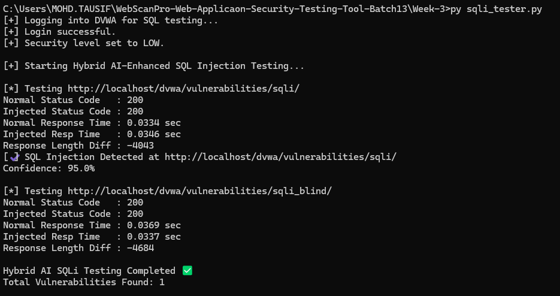  
*Fig 3.1: Terminal output displaying HTTP status codes, response timing, length difference, and AI confidence score.*

---

### 🌐 Manual SQL Injection Validation  
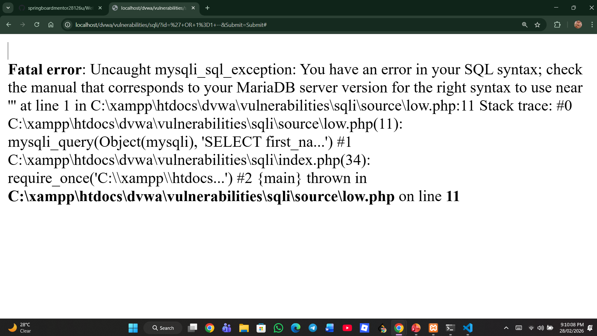  
*Fig 3.2: Manual SQL Injection payload execution confirming vulnerability.*

---

### 📄 SQL JSON Report  
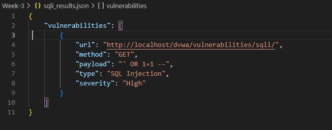  
*Fig 3.3: Structured SQL vulnerability report generated by the hybrid detection engine.*

---

### 🚀 Full Scan Execution  
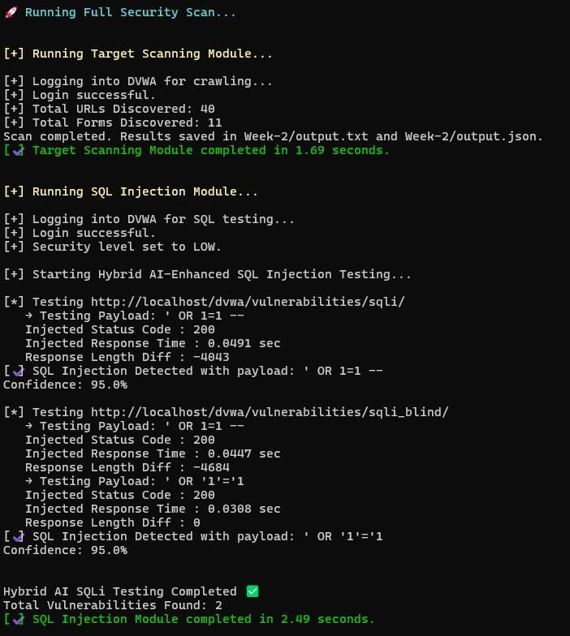  
*Fig 3.4: Integrated workflow showing scanner and SQL Injection module execution.*

---

## 🔸 Week 3 Result  

✔ Hybrid SQL Injection detection implemented  
✔ Multi-payload SQL injection testing added  
✔ HTTP response code monitoring integrated  
✔ Response time behavioral analysis implemented  
✔ AI classification with confidence scoring  
✔ Structured vulnerability reporting generated  

---

# 🔹 Week 4 – Hybrid XSS Testing Module (AI-Enhanced)

## 🔸 Objective  

The objective of Week 4 was to implement an **AI-assisted Cross-Site Scripting (XSS) detection engine** capable of detecting both reflected and stored XSS vulnerabilities.

This module analyzes application responses after injecting XSS payloads and uses both **rule-based detection and AI-assisted response analysis**.

---

## 🔸 Technologies Used  

- Python  
- Requests  
- BeautifulSoup  
- Scikit-learn (Logistic Regression)  
- JSON  
- Pickle  

---

## 🔸 About `xss_tester.py`

The XSS testing module performs the following tasks:

- DVWA authentication  
- Security level configuration  
- XSS payload injection  
- HTTP response code monitoring  
- Response time comparison  
- Payload reflection detection  
- Stored XSS verification through page reload analysis  
- Rule-based script detection  
- AI-assisted behavioral classification  
- Confidence score calculation  
- JSON vulnerability reporting  

---

## 🔸 XSS Payloads Used  

To test different injection contexts, the module uses multiple XSS payloads.

Exampl`e payloads:
```js
    <script>alert(1)</script>
    
    <svg/onload=alert(1)>
    "><script>alert(1)</script>
    <body onload=alert(1)>
```
These payloads allow detection of:

- Script-based XSS  
- Event-handler XSS  
- HTML attribute injection  
- SVG-based XSS vectors  

---

## 🔸 Stored XSS Detection  

The module also performs detection of **Stored XSS vulnerabilities**.

Detection process:

1 Inject the payload into the application  
2 Send the request to store the payload  
3 Reload the page after injection  
4 Check if the payload appears in the page response  

If the injected payload appears after reload, the system flags a **Stored XSS vulnerability**.

---

## 🔸 Hybrid Detection Architecture  

### 🔹 Rule-Based Detection  

The rule-based engine checks for:

- Direct payload reflection  
- Script tag presence in responses  
- Encoded script patterns  

---

### 🔹 AI-Based Detection  

The AI model analyzes response characteristics including:

- Response length difference  
- HTTP response code variation  
- Content pattern changes  

Prediction example:
```js
    prediction, probability = predict(features)
```
---

### 🔹 Final Detection Logic  
```js
    if rule_based_detected or prediction == 1
```
This hybrid method improves XSS detection accuracy and reduces false positives.

---

## 📄 Output – `xss_results.json`

Example output generated by the module:
```python
    {
      "vulnerabilities": [
        {
          "url": "http://localhost/dvwa/vulnerabilities/xss_r/",
          "method": "GET",
          "payload": "<script>alert(1)</script>",
          "type": "XSS",
          "severity": "High",
          "confidence": 92.0
        }
      ]
    }
```

---

## 📸 Week 4 Screenshots  

### 🤖 Hybrid XSS Detection (CLI Output)  
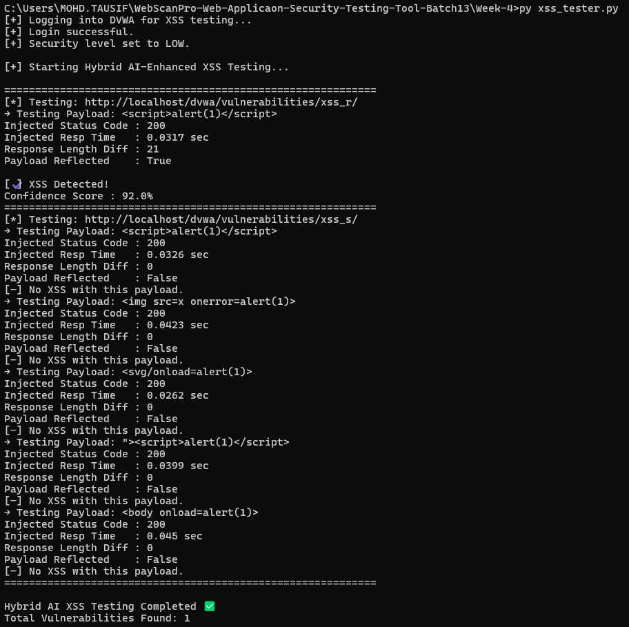  
*Fig 4.1: Terminal output showing HTTP response codes, timing analysis, payload reflection status, and AI confidence score.*

---

### 🌐 Manual XSS Payload Execution  
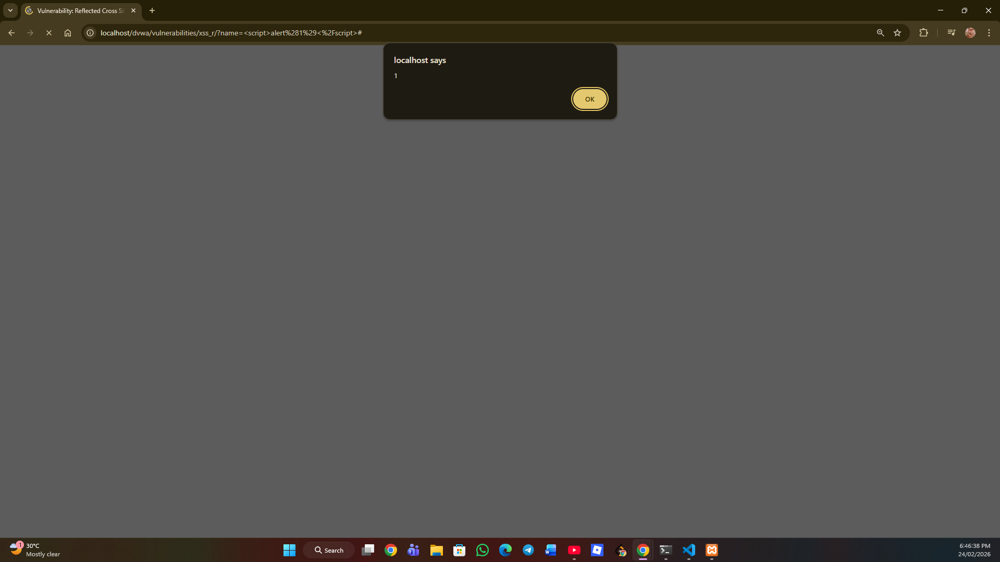  
*Fig 4.2: Manual execution of XSS payload demonstrating script injection vulnerability.*

---

### 📄 XSS JSON Report  
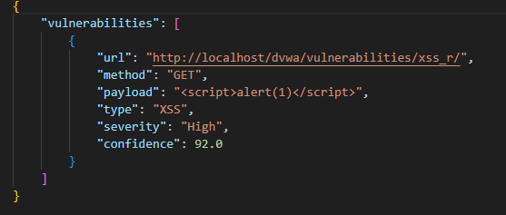  
*Fig 4.3: Structured JSON report containing detected XSS vulnerability.*

---

### 🧠 Hybrid Detection Logic  

```python
 # ---------------- RULE-BASED DETECTION ---------------- #

            rule_based_detected = False

            if payload_reflected:
                rule_based_detected = True

            if "<script>" in injected_text and "alert(1)" in injected_text:
                rule_based_detected = True

            if "&lt;script&gt;" in injected_text:
                rule_based_detected = True

            # ---------------- AI DETECTION ---------------- #

            features = extract_xss_features(
                normal_text,
                injected_text,
                injected_response.status_code
            )

            prediction, probability = predict(features)

            # ---------------- FINAL DECISION ---------------- #

            if rule_based_detected or prediction == 1:

                if rule_based_detected:
                    confidence = 92.0
                else:
                    confidence = round(probability * 100, 2)

                print("\n[✔] XSS Detected!")
                print(f"Confidence Score     : {confidence}%")

                vulnerable.append({
                    "url": action,
                    "method": method.upper(),
                    "payload": XSS_PAYLOAD,
                    "type": "XSS",
                    "severity": "High",
                    "confidence": confidence
                })

            else:
                print("[–] No XSS Detected.")

        except Exception as e:
            print(f"[!] Error testing {action}: {e}")
            continue

    print("=" * 60)
    return vulnerable
```
*Fig 4.4: Hybrid rule-based and AI detection architecture implemented in the module.*

---

## 🔸 Week 4 Result  

✔ Reflected XSS detection implemented  
✔ Stored XSS detection implemented  
✔ Multi-payload XSS testing added  
✔ Hybrid AI detection architecture integrated  
✔ Response behavior monitoring enabled  
✔ Confidence-based vulnerability reporting implemented  

---

# 🎯 Milestone 2 Outcome  

Milestone 2 transforms WebScanPro into a **hybrid AI-powered web vulnerability scanner** capable of performing automated exploitation testing.

The framework can now detect:

✔ SQL Injection vulnerabilities using hybrid AI detection  
✔ Cross-Site Scripting vulnerabilities (Reflected & Stored)  
✔ Multiple payload-based attack vectors  
✔ Behavioral anomalies in server responses  
✔ Vulnerabilities with confidence-based scoring  

By combining **rule-based vulnerability detection with machine learning-driven behavioral analysis**, WebScanPro becomes capable of **performing automated vulnerability discovery with improved accuracy and reliability**.
---
# 📌 MILESTONE 3

## Authentication & Session Security Testing (AI-Enhanced)

Milestone 3 expands **WebScanPro's security testing capabilities** by introducing **authentication analysis and access control vulnerability detection**.

While earlier milestones focused on **input-based vulnerabilities** such as SQL Injection and XSS, this milestone introduces modules capable of identifying **authentication weaknesses and access control flaws**, which are among the most critical issues in modern web applications.

This milestone focuses on detecting:

- Weak authentication mechanisms  
- Default credential vulnerabilities  
- Session cookie exposure risks  
- Access control weaknesses  
- Insecure Direct Object Reference (IDOR) vulnerabilities  

The modules implemented in this milestone allow WebScanPro to analyze **how applications handle user authentication and access permissions**, helping detect security misconfigurations that could allow unauthorized access.

---

# 🔹 Week 5 – Authentication & Session Testing Module

## 🔸 Objective

The objective of Week 5 was to design a module capable of analyzing the **security strength of authentication systems**.

Weak authentication systems often allow attackers to gain unauthorized access using **default credentials or weak password patterns**.

The authentication module performs automated login attempts using common credentials and analyzes server responses to determine whether authentication was successful.

It also examines **session cookies generated by the application** to understand how user sessions are managed.

---

# 🤖 AI Features Introduced

The authentication module integrates simple **AI-assisted logic** to improve vulnerability detection accuracy.

### 1️⃣ AI Password Pattern Generation

Instead of relying only on static credentials, the system generates **common password patterns automatically**, such as:

```
admin123
admin@123
password123
root123
```

This simulates how attackers use **intelligent password guessing techniques** to bypass weak authentication systems.

---

### 2️⃣ AI Login Response Analysis

The module analyzes the **server response content** to determine whether authentication succeeded.

Instead of relying only on error messages, the system checks for **authentication success indicators**, such as:

```
logout
welcome
dashboard
```

This approach improves detection accuracy and reduces false positives.

---

### 3️⃣ AI-Assisted Vulnerability Classification

Detected vulnerabilities are automatically classified with severity levels.

| Vulnerability | Severity |
|---------------|----------|
| Weak Credentials | High |
| Session Risk | Medium |
| Cookie Discovery | Info |

This allows WebScanPro to produce **structured security findings automatically**.

---

# 🔸 Technologies Used

- Python  
- Requests  
- BeautifulSoup  
- JSON  
- DVWA (Security Level: LOW)  
- XAMPP  

---

# 🔸 About `auth_session_tester.py`

The authentication testing module performs the following tasks:

- Attempts login using **default credentials**
- Generates **AI-assisted password guesses**
- Automates authentication requests
- Detects **weak login combinations**
- Identifies **session cookies generated by the server**
- Stores detected vulnerabilities in a structured JSON report

---

# 🔸 Authentication Testing Methodology

The module loads a list of username and password combinations from:

```
credentials.txt
```

Example credential list:

```
admin:admin
admin:password
root:root
test:test
admin:123456
```

For each credential pair, the module sends an authentication request to:

```
http://localhost/dvwa/login.php
```

The response is analyzed using **AI-assisted response inspection** to determine whether login was successful.

If authentication succeeds, the module flags it as a **Weak Authentication Vulnerability**.

---

# 🔸 Session Cookie Analysis

After performing login attempts, the module checks cookies returned by the server.

Typical cookies detected in DVWA include:

```
PHPSESSID
security
```

These cookies are used by the application to maintain user sessions.

If cookies are exposed without proper security flags, attackers may attempt **session hijacking attacks**.

---

# 📄 Output – `auth_results.json`

The module generates a structured vulnerability report:

```
[
  {
    "type": "Weak Credentials",
    "username": "admin",
    "password": "password",
    "severity": "High"
  },
  {
    "type": "Cookie Found",
    "cookie_name": "PHPSESSID",
    "severity": "Info"
  }
]
```

---

# 📸 Week 5 Screenshots

### 🔐 Authentication Module Execution

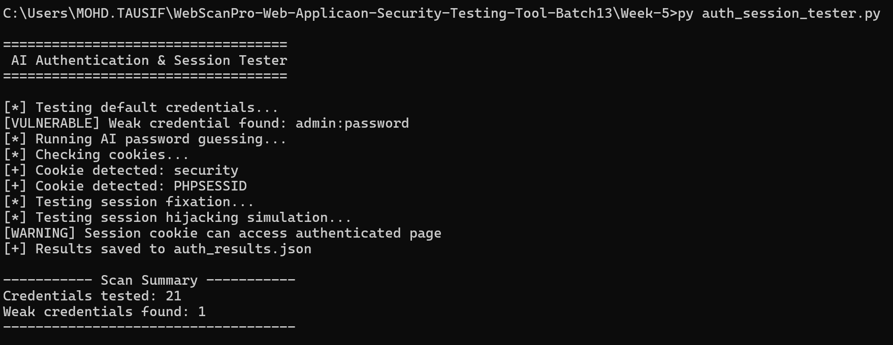

*Fig 5.1: Execution of the authentication and session testing module.*

---

### 🔑 Weak Credential Detection

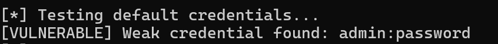

*Fig 5.2: Detection of weak login credentials during automated testing.*

---

### 🍪 Session Cookie Detection

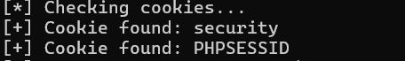

*Fig 5.3: Session cookies discovered during authentication testing.*

---

### 📄 Authentication JSON Report

```
[
  {
    "type": "Weak Credentials",
    "username": "admin",
    "password": "password",
    "severity": "High"
  },
  {
    "type": "Cookie Found",
    "cookie_name": "security",
    "severity": "Info"
  },
  {
    "type": "Cookie Found",
    "cookie_name": "PHPSESSID",
    "severity": "Info"
  }
]
```

*Fig 5.4: Structured JSON report generated by the authentication testing module.*

---

# 🔸 Week 5 Result

✔ Weak authentication vulnerabilities successfully detected  
✔ Default credential testing implemented  
✔ AI-assisted password testing integrated  
✔ Session cookie discovery implemented  
✔ Structured vulnerability reporting added  

---

# 🔹 Week 6 – Access Control & IDOR Testing Module (AI-Enhanced)

## 🔸 Objective

The objective of Week 6 was to design a module capable of detecting **Access Control vulnerabilities**, specifically **Insecure Direct Object Reference (IDOR)** issues.

IDOR vulnerabilities occur when applications expose internal object identifiers such as:

```
?id=1
?id=2
?id=3
```

Without proper access control validation, attackers may manipulate these identifiers to **access unauthorized data belonging to other users**.

---

# 🤖 AI Features Introduced

### 1️⃣ Response Similarity Analysis

Instead of relying only on error messages, the module compares **entire HTTP responses** between different object identifiers.

If two responses are highly similar, it may indicate that the application is returning **unauthorized data without proper validation**.

Example similarity result:

```
Testing ID=2 | Similarity Score: 0.94
```

A similarity score above **0.90** suggests a potential IDOR vulnerability.

---

### 2️⃣ Behavioral Response Comparison

The module analyzes multiple behavioral indicators:

- Response content similarity  
- HTTP response status codes  
- Page structure patterns  
- Returned data consistency  

These indicators help detect **unauthorized data exposure even when responses differ slightly**.

---

### 3️⃣ Automated Vulnerability Classification

Detected issues are automatically classified with severity levels.

| Vulnerability | Severity |
|---------------|----------|
| IDOR Detected | High |
| Suspicious Access | Medium |
| Normal Response | Info |

---

# 🔸 Technologies Used

- Python  
- Requests  
- Difflib (Response Similarity Engine)  
- JSON  
- DVWA (Security Level: LOW)  
- XAMPP  

---

# 🔸 About `idor_tester.py`

The IDOR testing module performs the following tasks:

- Sends requests with **different object IDs**
- Compares responses against a **baseline response**
- Calculates **response similarity scores**
- Detects potential **unauthorized data access**
- Logs findings in a structured JSON report

---

# 🔸 IDOR Testing Methodology

Example target endpoint:

```
http://localhost/dvwa/vulnerabilities/idor/?id=
```

### Step 1 — Baseline Request

The module first sends a request with a known ID:

```
?id=1
```

This response becomes the **baseline reference**.

---

### Step 2 — Parameter Manipulation

The module automatically tests multiple identifiers:

```
?id=2
?id=3
?id=4
?id=5
```

This simulates **horizontal privilege escalation attempts**.

---

### Step 3 — Similarity Detection

Responses are compared using the following logic:

```
def similarity_score(a, b):
    return difflib.SequenceMatcher(None, a, b).ratio()
```

If the similarity score exceeds **0.90**, the module flags a **possible IDOR vulnerability**.

---

# 📄 Output – `idor_results.json`

Example report generated by the module:

```
[
  {
    "type": "IDOR Vulnerability",
    "parameter": "id",
    "tested_value": 2,
    "similarity_score": 0.94,
    "severity": "High"
  }
]
```
---
# 📸 Week 6 Screenshots

### 🔍 IDOR Module Execution

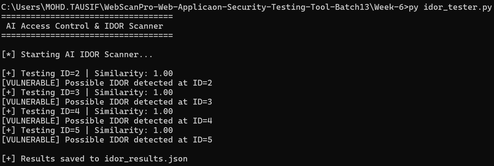

*Fig 6.1: Execution of the AI-based IDOR testing module performing automated parameter manipulation.*

---

### ⚠️ IDOR Vulnerability Detection

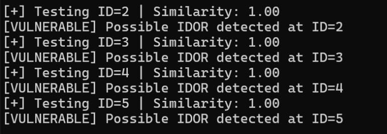

*Fig 6.2: Detection of insecure direct object reference vulnerability through response similarity analysis.*

---

# 🔸 Week 6 Result

✔ Automated IDOR vulnerability detection implemented  
✔ Response similarity analysis integrated  
✔ Unauthorized object access detection enabled  
✔ Horizontal privilege escalation testing implemented  
✔ Structured vulnerability reporting added  

---

# 🎯 Milestone 3 Outcome

Milestone 3 significantly expands **WebScanPro's security coverage** by introducing authentication security testing and access control vulnerability detection.

The framework can now detect:

✔ Weak authentication mechanisms  
✔ Default credential vulnerabilities  
✔ Session cookie exposure risks  
✔ Insecure Direct Object Reference (IDOR) vulnerabilities  
✔ Unauthorized data access attempts  

This milestone enables WebScanPro to detect vulnerabilities from two critical **OWASP Top 10 categories**:

- Identification & Authentication Failures  
- Broken Access Control  

---

# 📌 MILESTONE 4  
## Security Report Generation & Final Documentation

Milestone 4 focuses on **finalizing WebScanPro as a complete security testing framework** by implementing a **centralized vulnerability reporting system and project documentation**.

All previously developed modules are integrated, and their outputs are consolidated into structured reports.

This milestone transforms WebScanPro from a collection of modules into a **complete automated security assessment tool**.

---

# 🔹 Week 7 – Security Report Generation Module

## 🔸 Objective

The objective of Week 7 was to design a **centralized vulnerability reporting system** that collects results from all modules and generates structured security reports.

This allows testers to quickly understand the **overall security posture of the target application**.

---

## 🔸 Features Implemented

The reporting module performs the following tasks:

- Collects vulnerability results from all module outputs  
- Organizes vulnerabilities by type and severity  
- Identifies affected endpoints  
- Generates structured JSON reports  

The reporting system integrates outputs from:

```
output.json
sqli_results.json
xss_results.json
auth_results.json
idor_results.json
```
---
# 📸 Week 7 Screenshots

### 📊 Report Generation Execution

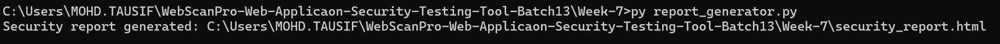

*Fig 7.1: Execution of the security report generation module producing the final WebScanPro security report.*

---

### 🛡 Security Report Dashboard

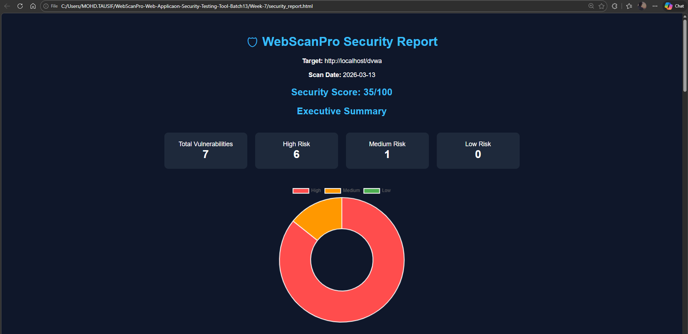

*Fig 7.2: WebScanPro HTML security report dashboard displaying scan information and security score.*

---

### 📋 Vulnerability Summary Table

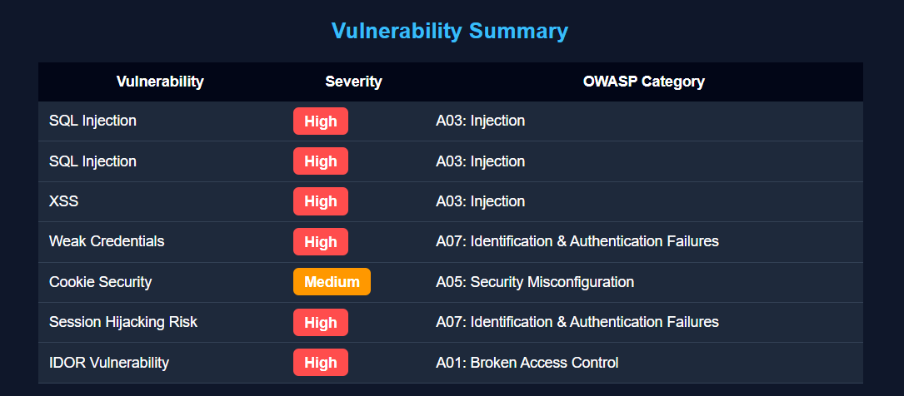

*Fig 7.3: Vulnerability summary table listing detected issues and their severity levels.*

---

### 🔎 Detailed Vulnerability Findings

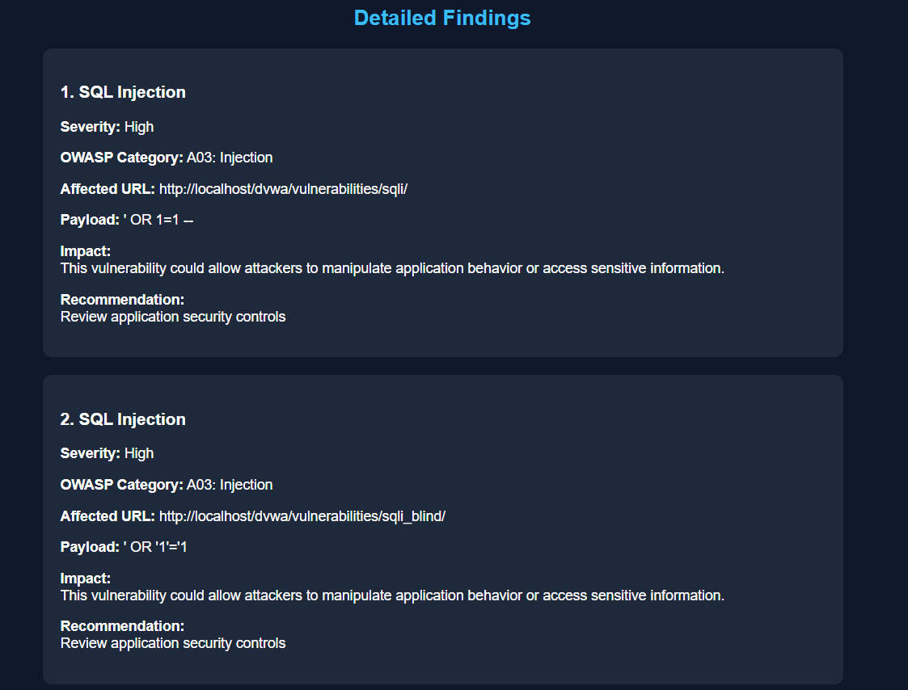

*Fig 7.4: Detailed findings section showing vulnerability type, affected URL, payload, and remediation recommendations.*

---

# 🔹 Week 8 – Documentation & Presentation Preparation

## 🔸 Objective

The final week focused on **preparing project documentation and presentation materials**.

This includes explaining the system architecture, vulnerability detection modules, and testing results.

---

## 🔸 Documentation Work

The following tasks were completed:

- Project overview documentation  
- Detailed module explanations  
- Security testing methodology  
- Vulnerability detection results  
- Screenshots and demonstration outputs  

---

## 🔸 Presentation Preparation

A project presentation was prepared covering:

- WebScanPro architecture  
- AI-assisted vulnerability detection modules  
- Testing workflow on DVWA  
- Security findings and generated reports  

A **live demonstration** was also prepared showing:

- Running the scanner  
- Detecting vulnerabilities  
- Generating security reports

---

# 🔸 Week 7–8 Result

✔ Centralized vulnerability reporting system implemented  
✔ Security findings consolidated from all modules  
✔ Structured report generation completed  
✔ Full project documentation prepared  
✔ Final project presentation completed  

---

# 🎯 Milestone 4 Outcome

Milestone 4 completes the **WebScanPro security testing framework** by adding reporting and documentation capabilities.

The final system now provides:

✔ Automated target scanning  
✔ AI-enhanced SQL Injection detection  
✔ AI-enhanced XSS detection  
✔ Authentication and session security testing  
✔ Access control and IDOR vulnerability detection  
✔ Centralized vulnerability reporting  

With all modules integrated, **WebScanPro becomes a fully functional AI-assisted web application security testing tool capable of detecting multiple OWASP Top 10 vulnerabilities automatically.**

---
## 🧠 WebScanPro System Architecture (AI-Enhanced)

```
┌─────────────────────────────────────────────────────────────┐
│                         User Interface                      │
│                         (CLI - main.py)                     │
└──────────────────────────────┬──────────────────────────────┘
                               │ Run Security Scan
                               ▼
┌─────────────────────────────────────────────────────────────┐
│                       WebScanPro Engine                     │
│                     (Python Security Core)                  │
├─────────────────────────────────────────────────────────────┤
│                                                             │
│  ┌──────────────┐     ┌──────────────┐     ┌──────────────┐ │
│  │   Scanner    │     │  SQLi AI     │     │   XSS AI     │ │
│  │ (Week-2)     │ ───►│ (Week-3)     │ ───►│ (Week-4)     │ │
│  │ scanner.py   │     │ sqli_tester  │     │ xss_tester   │ │
│  └──────────────┘     └──────────────┘     └──────────────┘ │
│         │                    │                    │          │
│         ▼                    ▼                    ▼          │
│  ┌────────────────────────────────────────────────────────┐ │
│  │        AI Authentication & Session Security Module     │ │
│  │                 (Week-5 Module)                        │ │
│  │                                                        │ │
│  │  • Default Credential Testing                          │ │
│  │  • AI Password Pattern Generation                      │ │
│  │  • Login Response Analysis                             │ │
│  │  • Session Cookie Discovery                            │ │
│  │  • Authentication Vulnerability Detection              │ │
│  │                                                        │ │
│  │            auth_session_tester.py                      │ │
│  └────────────────────────────────────────────────────────┘ │
│                                                             │
└──────────────────────────────┬──────────────────────────────┘
                               │ HTTP Requests / Payloads
                               ▼
┌─────────────────────────────────────────────────────────────┐
│                    Target Web Application                   │
│                          (DVWA)                             │
│                                                             │
│   • SQL Injection Vulnerabilities                           │
│   • Cross-Site Scripting (XSS)                              │
│   • Weak Authentication                                     │
│   • Session Cookies                                         │
└──────────────────────────────┬──────────────────────────────┘
                               │
                               ▼
┌─────────────────────────────────────────────────────────────┐
│                      Security Reports                       │
│                                                             │
│  output.json       → Target Scanner Results                 │
│  sqli_results.json → SQL Injection Findings                 │
│  xss_results.json  → XSS Vulnerabilities                    │
│  auth_results.json → Authentication & Session Issues        │
└─────────────────────────────────────────────────────────────┘
```

---

## 🔄 WebScanPro Data Flow Diagram (AI-Enhanced)

```
┌──────────┐   1. Start Scan Request   ┌──────────────┐
│  User    │──────────────────────────►│   main.py    │
│  (CLI)   │                           │  Controller  │
└──────────┘                           └──────────────┘
                                              │
                                              │ 2. Initialize Scan
                                              ▼
                                        ┌─────────────┐
                                        │   Scanner   │
                                        │  Week-2     │
                                        └─────────────┘
                                              │
                         ┌────────────────────┼────────────────────┐
                         │ 3. Discover URLs   │ 4. Extract Forms   │
                         ▼                    ▼                    ▼
                   ┌─────────────┐     ┌─────────────┐      ┌─────────────┐
                   │  URL Crawl  │────►│ Form Parser │─────►│ Scan Data   │
                   └─────────────┘     └─────────────┘      │ Repository  │
                                                            │ output.json │
                                                            └─────────────┘
                                              │
                                              │ 5. Vulnerability Testing
                                              ▼
                                  ┌───────────────────────┐
                                  │  SQL Injection Module │
                                  │      Week-3 (AI)      │
                                  └───────────────────────┘
                                              │
                                              │ 6. Behavioral + Payload Analysis
                                              ▼
                                  ┌───────────────────────┐
                                  │   XSS Testing Module  │
                                  │      Week-4 (AI)      │
                                  └───────────────────────┘
                                              │
                                              │ 7. AI Authentication Testing
                                              ▼
                              ┌────────────────────────────────┐
                              │ AI Authentication & Session    │
                              │ Security Testing Module        │
                              │           Week-5               │
                              │                                │
                              │ • Default Credential Testing   │
                              │ • AI Password Guessing         │
                              │ • Login Response Analysis      │
                              │ • Session Cookie Discovery     │
                              └────────────────────────────────┘
                                              │
                                              │ 8. Store Findings
                                              ▼
                                ┌─────────────────────────────┐
                                │  Security Reports Generator │
                                │                             │
                                │  output.json                │
                                │  sqli_results.json          │
                                │  xss_results.json           │
                                │  auth_results.json          │
                                └─────────────────────────────┘
                                              │
                                              │ 9. Display Results
                                              ▼
                                        ┌─────────────┐
                                        │   Terminal  │
                                        │   Output    │
                                        └─────────────┘
```
