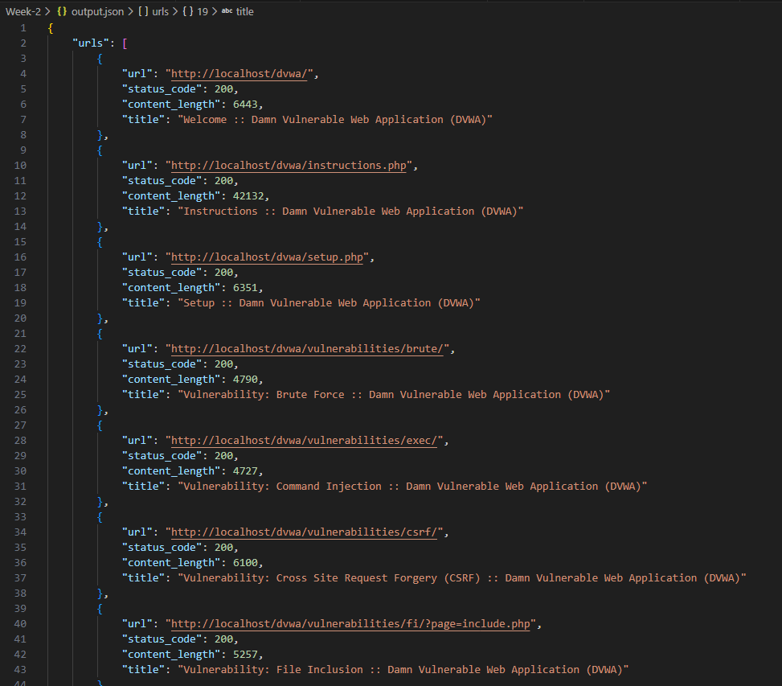

<div align="center">

# 🚀 WEBSANPRO – WEB APPLICATION SECURITY TESTING TOOL - BATCH 13 🚀

</div>

---

# 📌 MILESTONE 1  
## Project Setup & Target Scanning Module  

This milestone covers the basic setup of the project and development of the first scanning module.

---

# 🔹 Week 1 – Project Initialization & Setup  

## 🔸 About the Project  

WebScanPro is a tool that checks web applications for common security problems like:

- SQL Injection  
- Cross-Site Scripting (XSS)  
- Weak login systems  
- Other common web security issues  

In Week 1, the goal was to set up everything and understand how the vulnerable application works.

---

## 🔸 Tools Used  

- XAMPP (Local Server – Apache & MySQL)  
- DVWA (Damn Vulnerable Web Application)  
- PHP & MySQL  
- Web Browser  
- Git & GitHub  

---

## 🔸 What I Did in Week 1  

### 1️⃣ Installed and Configured Environment  

- Installed XAMPP  
- Started Apache and MySQL  
- Downloaded DVWA  
- Placed DVWA inside `htdocs`  
- Created a database named `dvwa`  
- Updated configuration settings  
- Initialized the database  

After this, DVWA was running successfully in the browser.

---

## 🔸 Explored Vulnerability Modules  

I explored the following modules:

- **Brute Force Module** – Shows weak login system  
- **SQL Injection Module** – Shows database vulnerability  
- **XSS Module** – Shows how scripts can run in browser  

I only explored the structure and inputs.

---

## 🔸 Week 1 Result  

✔ DVWA installed successfully  
✔ Vulnerability pages identified  
✔ Input fields located  
✔ Environment ready for automation  

---

## 📸 Week 1 Screenshots  

### 🖥️ XAMPP Running


### 🏠 DVWA Dashboard


### 🔐 Brute Force Module


### 💉 SQL Injection Module


### ⚡ XSS Reflected Module

  

---

# 🔹 Week 2 – Target Scanning Module  

## 🔸 Objective  

The goal of Week 2 was to create a Python scanner that automatically finds:

- Forms  
- Input fields  
- Form actions  
- HTTP methods  

This information will be used later for automated testing.

---

## 🔸 Technologies Used  

- Python  
- Requests Library  
- BeautifulSoup  
- DVWA  
- XAMPP  

---

## 🔸 About scanner.py  

I created a Python script called `scanner.py`.

This script:

- Starts from DVWA homepage  
- Sends request to the website  
- Reads the HTML content  
- Finds all `<form>` elements  
- Extracts:
  - Form action  
  - Method (GET/POST)  
  - Input names  
  - Input types  
- Saves the results into files  

The scanner does not attack the website.  
It only collects useful information.

---

## 🔸 How the Scanner Works  

1. Starts from `http://localhost/dvwa/`  
2. Sends HTTP request  
3. Parses HTML using BeautifulSoup  
4. Extracts forms and inputs  
5. Saves results in output files  

---

## 🔸 Output Files  

### 📄 output.json  
Contains structured data:
- Page URL  
- Form action  
- Method  
- Input names and types  

### 📄 Output JSON Result


---

### 📄 output.txt  
Readable scan results  

### 📄 Output TXT Result
```
=== Discovered URLs ===

=== Forms & Input Fields ===
{'page': 'http://localhost/dvwa/', 'action': 'login.php', 'method': 'post', 'inputs': [{'name': 'username', 'type': 'text'}, {'name': 'password', 'type': 'password'}, {'name': 'Login', 'type': 'submit'}, {'name': 'user_token', 'type': 'hidden'}]}
```

---

## 🔸 Scan Results  

The scanner found the DVWA login form and extracted:

- username  
- password  
- user_token  
- submit button  

Only the login page was scanned because internal pages need authentication.

---

## 📸 Week 2 Screenshots  

### ▶ Scanner Execution Output
  
### 🐍 Python Version Verification
  

---

## 🔸 Limitations  

- Scanner does not login yet  
- Internal pages cannot be scanned  
- Session handling will be added later  

---

# ✅ Milestone 1 Summary  

✔ Local testing environment set up  
✔ DVWA configured successfully  
✔ Vulnerability modules explored  
✔ Python scanner developed  
✔ Forms and input fields extracted  
✔ Structured output files generated  

Milestone 1 builds the base for developing a complete web security testing tool.
